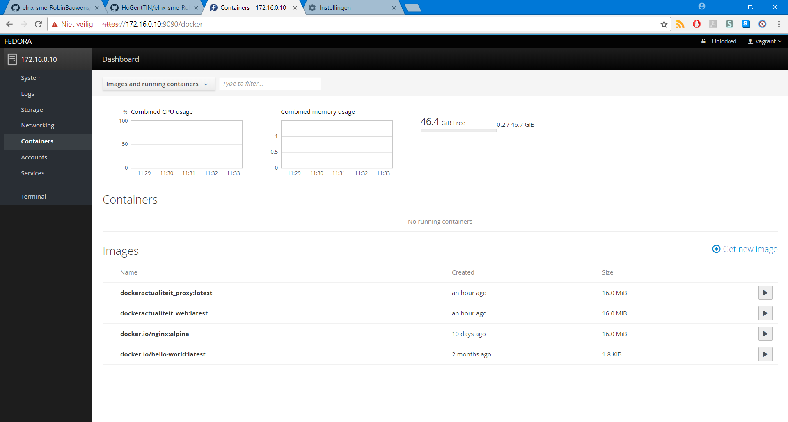
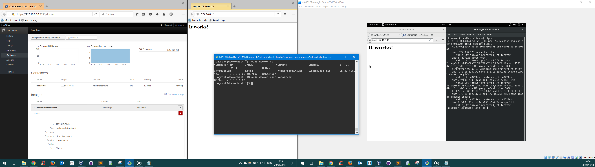
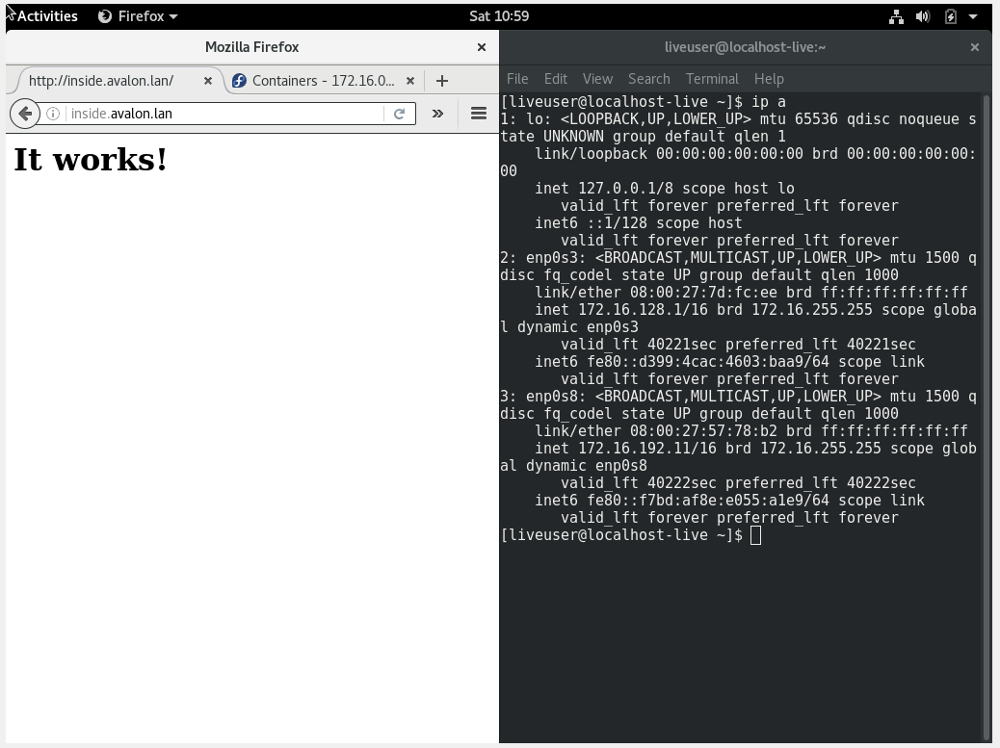
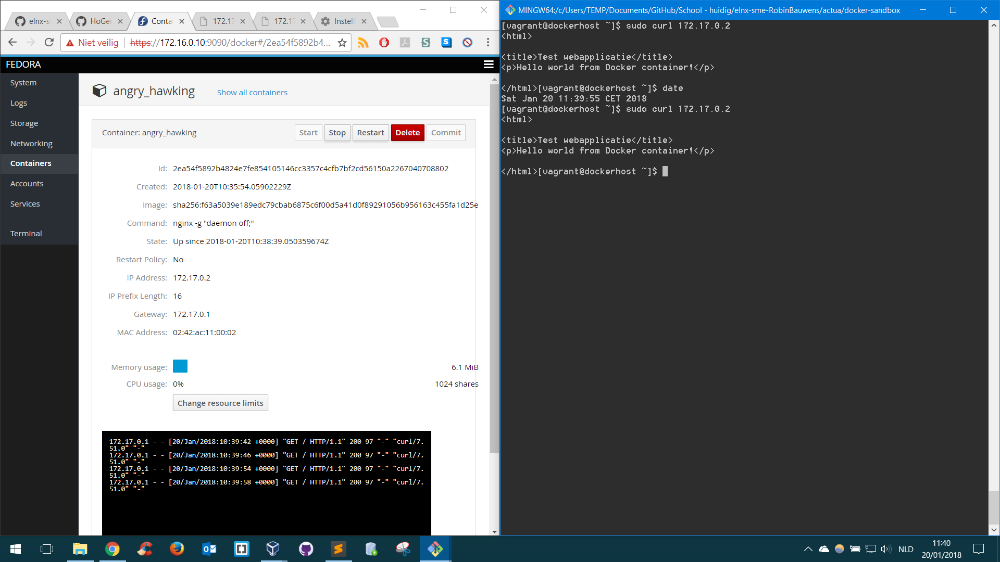
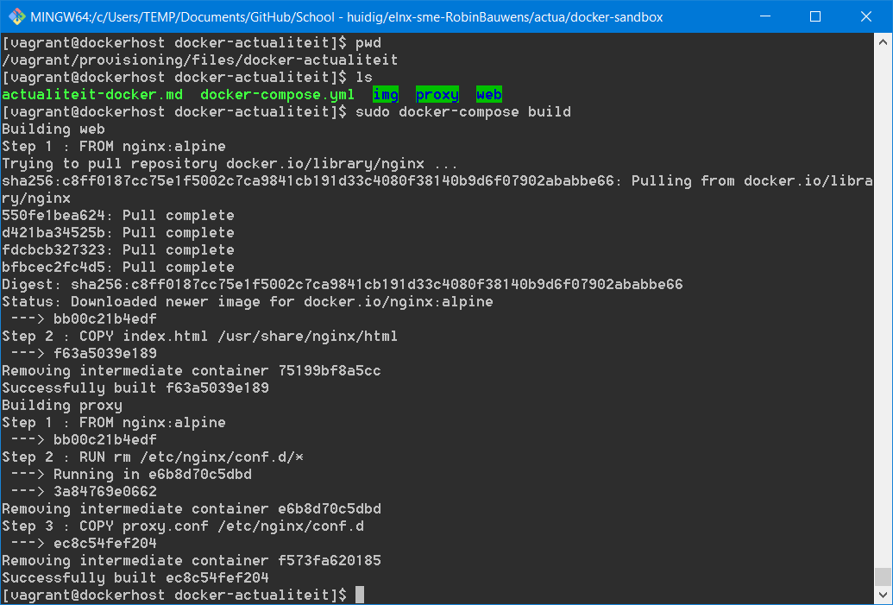
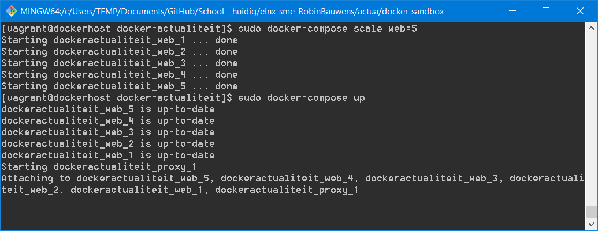

# Documentatie Docker intranet

## Voorbereiding en opzetten omgeving

In de SME-opdracht wordt IP-adres `172.16.0.10` met alias `inside` voorzien als intranet webserver. 
<details>
    <summary>
Volgende code (in `pu001.yml`) voorziet dit:
    </summary> 
    <p> 
```
- name: pr010
  ip: 172.16.0.10
  aliases: 
    - inside
``` 
    </p> 
</details>


De bedoeling is dat we de mogelijkheden van Docker (intranet webserver) testen binnen ons netwerk bij het surfen naar `inside.avalon.lan`.

Alle configuratie bevindt zich in `/actua`, clone eerst het [startproject van bertvv/docker-sandbox](https://github.com/bertvv/docker-sandbox) en plaats dit dan ook in `/actua`.

Gebruik volgende code voor `vagrant-hosts.yml`:

```
- name: dockerhost
  ip: 172.16.0.10
  netmask: 255.255.0.0
  box: bertvv/fedora25
```

Er zit nog een fout in het opstarten, waarschijnlijk is dit te wijten aan een verschillende versie van Vagrant/VirtualBox.

We proberen volgend commando eens om het probleem met de GuestAdditions-versies op te lossen: `vagrant plugin install vagrant-vbguest`

[Plugin vagrant-vbguest](https://kvz.io/blog/2013/01/16/vagrant-tip-keep-virtualbox-guest-additions-in-sync/)

**Foutboodschap:**
```
    dockerhost: SSH auth method: private key
==> dockerhost: Machine booted and ready!
[dockerhost] GuestAdditions versions on your host (5.1.30) and guest (5.1.12) do not match.
Last metadata expiration check: 0:00:47 ago on Fri Jan 19 21:55:28 2018.
No package kernel-devel-4.8.16-300.fc25.x86_64 available.
Package make-1:4.1-5.fc24.x86_64 is already installed, skipping.
Package bzip2-1.0.6-21.fc25.x86_64 is already installed, skipping.
Error: Unable to find a match.
==> dockerhost: Checking for guest additions in VM...
The following SSH command responded with a non-zero exit status.
Vagrant assumes that this means the command failed!

`bash -c 'type -p dnf || type -p yum'` install -y kernel-devel-`uname -r` gcc dkms make perl bzip2

Stdout from the command:

Last metadata expiration check: 0:00:47 ago on Fri Jan 19 21:55:28 2018.
No package kernel-devel-4.8.16-300.fc25.x86_64 available.


Stderr from the command:

Package make-1:4.1-5.fc24.x86_64 is already installed, skipping.
Package bzip2-1.0.6-21.fc25.x86_64 is already installed, skipping.
Error: Unable to find a match.
```

<!--*Mogelijke oplossingen: andere versie Vagrant en VirtualBox*-->

Zie [Sofware.md](https://github.com/HoGentTIN/elnx-sme-RobinBauwens/blob/solution/Software.md), we blijven werken met de huidige softwareversies.

Oplossing: we zullen werken met de box van `bertvv/centos72`, dit geeft bovenstaande fout niet (en zorgt er ook voor dat `enp0s8` wel een IP-adres krijgt. (Toevoegen via het maken van een (netwerk)configbestand en de netwerkservice te herstarten lost dit niet op).


**Met aangepaste Vagrantfile en vagrant-hosts.yml**

## Stappenplan `http`-container `inside.avalon.lan`
We gebruiken een herwerkte versie van de [Vagrantfile](https://github.com/HoGentTIN/elnx-sme-RobinBauwens/blob/solution/actua/dockerhost-sandbox/Vagrantfile).

We zetten de poorten open om de webserver te bereiken, we gaan niet expliciet een nieuw netwerk maken (binnen Docker)/nieuwe IP-adressen toekennen.

*Mochten we toch een nieuw netwerk maken bvb `172.16.0.0/16`, dan kunnen we de cockpit/dashboard op `172.16.0.10`  niet meer zien (omwille van een overlapping).*


1. Start de VM (in `/actua/dockerhost-sandbox` van het hostsysteem), SSH in de VM en voer het installatiescript uit in `/vagrant/provisioning`.

```
vagrant up dockerhost --provision
vagrant ssh
sudo /vagrant/provisioning/dockerhost.sh
```


2. Voer volgend commando uit:
```
sudo docker run -td --name webserver -p 80:80 httpd
```


https://github.com/HoGentTIN/elnx-sme-RobinBauwens/blob/solution/actua/dockerhost-sandbox/provisioning/files/docker-actualiteit/actualiteit-docker.md


### Opmerkingen: 

- We gebruiken de [officiële container](https://hub.docker.com/_/httpd/) van Apache HTTP Server Project.
- We voeren de container uit zonder zelf een Dockerfile te configureren, dit werd ook in bovenstaande link meegedeeld.

Indien we van het werkstation of het hostsysteem naar `172.16.0.10:9090` surfen zien we volgende pagina:


Indien we naar hetzelfde IP-adres surfen, maar met poort `80`: Dan krijgen we de standaardinstellingen van de `apache`-container te zien.



Surfen naar `inside.avalon.lan` vanaf het werkstation (adhv servernaam), geeft de webpagina ook weer:


<!--
Poorten nog niet open gezet (via ander IP-adres dus)
Als we nu een container (bvb een webcontainer) starten en de inhoud van webpagina afhalen mbhv `curl` (zie IP-adres in cockpit/dashboard).

-->


<!--
## Load-balancing

Binnen `/vagrant/provisioning/files` staat de configuratie van Docker (voor load-balancing). 

Hierna voeren we `sudo docker-compose build` uit (in `/vagrant/provisioning/docker-actualiteit`).



Hierna kunnen we volgende commando's uitvoeren:

```
sudo docker-compose scale web=5
sudo docker-compose up
```



-->

## Bronnen

- [Commando's docker-compose](https://stackoverflow.com/questions/39663096/docker-compose-creating-multiple-instances-for-the-same-image)
- [Docker install Fedora](https://docs.docker.com/engine/installation/linux/docker-ce/fedora/#install-from-a-package)
- [Container:IP toegankelijk maken](https://github.com/docker/for-win/issues/221)
- [**Docker networking (!)**](https://runnable.com/docker/basic-docker-networking)
- [Poorten openzetten Docker](https://www.youtube.com/watch?v=G36I1iqDZig)
- [Static IP Docker container](https://stackoverflow.com/questions/27937185/assign-static-ip-to-docker-container)
- [Ping local network from container](https://forums.docker.com/t/ping-local-network-from-container/38994/2)
- [Docker container Apache](https://stackoverflow.com/questions/27768194/how-to-use-docker-container-as-apache-server)
- [Docker wordpress image & docker-compose](https://www.sitepoint.com/how-to-use-the-official-docker-wordpress-image/)
- [Voer commando's uit binnen container](https://askubuntu.com/questions/505506/how-to-get-bash-or-ssh-into-a-running-container-in-background-mode)
- [Building a Simple Apache Web Server in a Container](https://access.redhat.com/articles/1328953)


<!--
Dit is gebaseerd op deze beginversie, maar zal de provisioning niet uitvoeren omwille van een fout (met Guest Additions?).
Verwijder het mapje `provisioning` en volgende lijn uit `Vagrantfile`:
```
      node.vm.provision 'shell', path: 'provisioning/' + host['name'] + '.sh'
```
-->
<!--

    Zou niet nodig moeten zijn:
Zet de IP-instellingen goed: we maken een `ifcfg-enp0s8` aan in `/etc/sysconfig/network-scripts` (gebruik administratorrechten).

```
TYPE=Ethernet
BOOTPROTO=none
NAME=enp0s8
DEVICE=enp0s8
ONBOOT=yes
IPADDR=172.16.0.10
NETMASK=255.255.0.0
```
-->

### Opmerkingen
- De naam blijft `dockerhost` bij `vagrant-hosts.yml`
