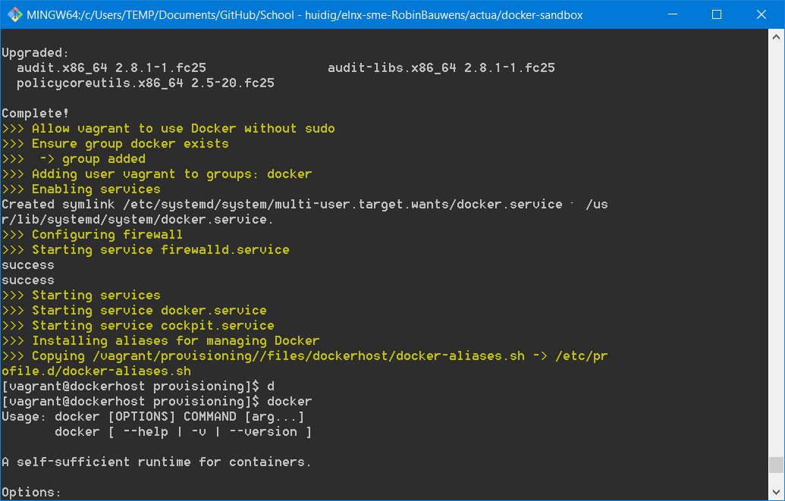

# Documentatie Docker intranet

## Stappenplan

In de SME-opdracht wordt IP-adres `172.16.0.10` met alias `inside` voorzien als intranet webserver. Volgende code voorziet dit:

```
- name: pr010
  ip: 172.16.0.10
  aliases: 
    - inside
```

De bedoeling is dat we de mogelijkheden van Nginx load-balancing testen binnen ons netwerk bij het surfen naar `inside.avalon.lan`.

Alle configuratie bevindt zich in `/actua`, clone eerst het [startproject van bertvv/docker-sandbox](https://github.com/bertvv/docker-sandbox) en plaats dit dan ook in `/actua`.

Gebruik volgende code voor `vagrant-hosts.yml`:

```
- name: dockerhost
  ip: 172.16.0.10
  netmask: 255.255.0.0
  box: bertvv/fedora25
```

Er zit nog een fout in het opstarten, waarschijnlijk is dit te wijten aan een verschillende versie van Vagrant/VirtualBox.

We proberen volgend commando eens om het probleem met de GuestAdditions-versies op te lossen: `vagrant plugin install vagrant-vbguest`

[Plugin vagrant-vbguest](https://kvz.io/blog/2013/01/16/vagrant-tip-keep-virtualbox-guest-additions-in-sync/)

```
    dockerhost: SSH auth method: private key
==> dockerhost: Machine booted and ready!
[dockerhost] GuestAdditions versions on your host (5.1.30) and guest (5.1.12) do not match.
Last metadata expiration check: 0:00:47 ago on Fri Jan 19 21:55:28 2018.
No package kernel-devel-4.8.16-300.fc25.x86_64 available.
Package make-1:4.1-5.fc24.x86_64 is already installed, skipping.
Package bzip2-1.0.6-21.fc25.x86_64 is already installed, skipping.
Error: Unable to find a match.
==> dockerhost: Checking for guest additions in VM...
The following SSH command responded with a non-zero exit status.
Vagrant assumes that this means the command failed!

`bash -c 'type -p dnf || type -p yum'` install -y kernel-devel-`uname -r` gcc dkms make perl bzip2

Stdout from the command:

Last metadata expiration check: 0:00:47 ago on Fri Jan 19 21:55:28 2018.
No package kernel-devel-4.8.16-300.fc25.x86_64 available.


Stderr from the command:

Package make-1:4.1-5.fc24.x86_64 is already installed, skipping.
Package bzip2-1.0.6-21.fc25.x86_64 is already installed, skipping.
Error: Unable to find a match.
```

*Mogelijke oplossingen: andere versie Vagrant en VirtualBox*

Zie `Sofware.md`, we blijven werken met de huidige softwareversies.

Oplossing: we zullen werken met de box van `bertvv/centos72`, dit geeft bovenstaande fout niet (en zrogt er ook voor dat `enp0s8` wel een IP-adres krijgt. (Toevoegen via het maken van een (netwerk)configbestand en de netwerkservice te herstarten lost dit niet op).


## Stappenplan met aangepaste Vagrantfile

We gebruiken een herwerkte versie van de Vagrantfile:

```
# -*- mode: ruby -*-
# vi: ft=ruby :

require 'rbconfig'
require 'yaml'

# Set your default base box here
DEFAULT_BASE_BOX = 'bertvv/fedora25'
# Indien deze niet werkt, gebruik: bertvv/centos72

VAGRANTFILE_API_VERSION = '2'
PROJECT_NAME = '/' + File.basename(Dir.getwd)

# When set to `true`, Ansible will be forced to be run locally on the VM
# instead of from the host machine (provided Ansible is installed).
FORCE_LOCAL_RUN = false

hosts = YAML.load_file('vagrant-hosts.yml')

# {{{ Helper functions

def run_locally?
  windows_host? || FORCE_LOCAL_RUN
end

def windows_host?
  RbConfig::CONFIG['host_os'] =~ /mswin|mingw|cygwin/
end

# Set options for the network interface configuration. All values are
# optional, and can include:
# - ip (default = DHCP)
# - netmask (default value = 255.255.255.0
# - mac
# - auto_config (if false, Vagrant will not configure this network interface
# - intnet (if true, an internal network adapter will be created instead of a
#   host-only adapter)
def network_options(host)
  options = {}

  if host.key?('ip')
    options[:ip] = host['ip']
    options[:netmask] = host['netmask'] ||= '255.255.255.0'
  else
    options[:type] = 'dhcp'
  end

  options[:mac] = host['mac'].gsub(/[-:]/, '') if host.key?('mac')
  options[:auto_config] = host['auto_config'] if host.key?('auto_config')
  options[:virtualbox__intnet] = true if host.key?('intnet') && host['intnet']
  options
end

def custom_synced_folders(vm, host)
  return unless host.key?('synced_folders')
  folders = host['synced_folders']

  folders.each do |folder|
    vm.synced_folder folder['src'], folder['dest'], folder['options']
  end
end

# }}}

Vagrant.configure(VAGRANTFILE_API_VERSION) do |config|
  config.ssh.insert_key = false
    hosts.each do |host|
    config.vm.define host['name'] do |node|
      node.vm.box = host['box'] ||= DEFAULT_BASE_BOX
      node.vm.box_url = host['box_url'] if host.key? 'box_url'

      node.vm.hostname = host['name']
      node.vm.network :private_network, network_options(host)
      custom_synced_folders(node.vm, host)

      node.vm.provider :virtualbox do |vb|
        # WARNING: if the name of the current directory is the same as the
        # host name, this will fail.
        vb.customize ['modifyvm', :id, '--groups', PROJECT_NAME]
      end
    end
  end
end
```

Start de VM met `vagrant up dockerhost --provision` en voer het installatiescript uit in `/vagrant/provisioning` met `sudo ./dockerhost.sh`.



Binnen `/vagrant/provisioning/files` plaatsen we de configuratie van Docker.

Hierna voeren we `sudo docker-compose build` uit (in `/vagrant/provisioning/docker-actualiteit`).


Hierna kunnen we volgende commando's uitvoeren:

```
sudo docker-compose scale web=5
sudo docker-compose up
```


Indien we van het hostsysteem naar `172.16.0.10:9090` surfen zien we volgende pagina:


Als we nu een container (bvb een webcontainer) starten en de inhoud van webpagina afhalen mbhv `curl` (zie IP-adres in cockpit/dashboard).


## Bronnen

- [Commando's docker-compose](https://stackoverflow.com/questions/39663096/docker-compose-creating-multiple-instances-for-the-same-image)
- [Docker install Fedora](https://docs.docker.com/engine/installation/linux/docker-ce/fedora/#install-from-a-package)
- [Container:IP toegankelijk maken](https://github.com/docker/for-win/issues/221)
- [**Docker networking (!)**](https://runnable.com/docker/basic-docker-networking)
- [Poorten openzetten Docker](https://www.youtube.com/watch?v=G36I1iqDZig)
- [Static IP Docker container](https://stackoverflow.com/questions/27937185/assign-static-ip-to-docker-container)
- [Ping local network from container](https://forums.docker.com/t/ping-local-network-from-container/38994/2)


<!--
Dit is gebaseerd op deze beginversie, maar zal de provisioning niet uitvoeren omwille van een fout (met Guest Additions?).
Verwijder het mapje `provisioning` en volgende lijn uit `Vagrantfile`:
```
      node.vm.provision 'shell', path: 'provisioning/' + host['name'] + '.sh'
```
-->
<!--

    Zou niet nodig moeten zijn:
Zet de IP-instellingen goed: we maken een `ifcfg-enp0s8` aan in `/etc/sysconfig/network-scripts` (gebruik administratorrechten).

```
TYPE=Ethernet
BOOTPROTO=none
NAME=enp0s8
DEVICE=enp0s8
ONBOOT=yes
IPADDR=172.16.0.10
NETMASK=255.255.0.0
```
-->

### Opmerkingen
- De naam blijft `dockerhost` bij `vagrant-hosts.yml`
