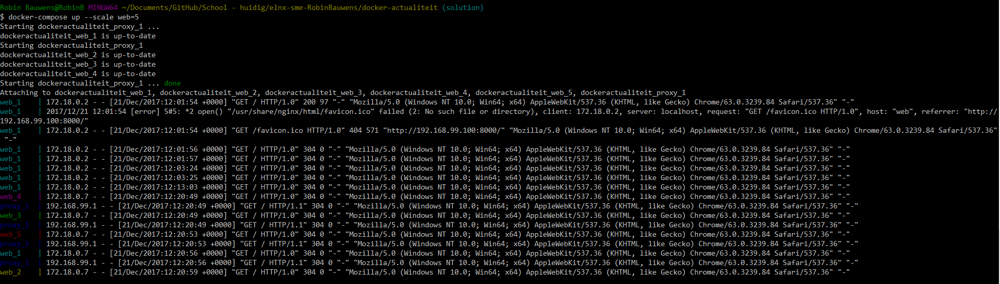
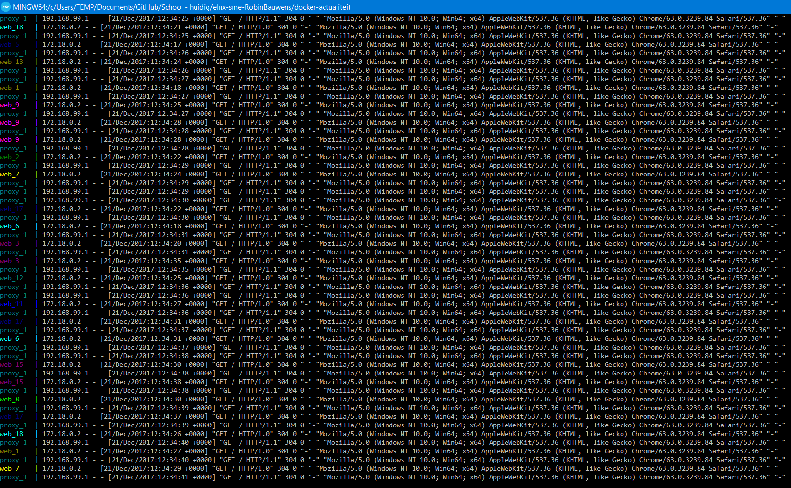

# Opdracht actualiteit: nieuwe techniek
## Docker-integratie webserver Nginx met proxy

### Inleiding
1. Zorg ervoor dat je Docker en Docker Toolbox geïnstalleerd hebt. De installatie zal Git Bash, VirtualBox etc. updaten. [Dit kan later tot gevolg hebben dat `vagrant ssh` niet meer zal werken](https://github.com/hashicorp/vagrant/issues/9027). Zorg ervoor dat je volgende versies hebt om dit probleem op te lossen:
- [Download de x64-versie van Vagrant 1.9.8 ipv versie >= 2.0.0](https://releases.hashicorp.com/vagrant/1.9.8/)
- Gebruik Oracle VirtualBox Version 5.1.30-118389 ipv 5.2.0 r118431 (Qt5.6.2)

2. Docker zal gebruik maken van Hyper-V, hiervoor heb je Windows 10 Education of Professional nodig. Upgrade deze indien nodig (nodig om te kunnen installeren).
3. Omdat we Docker Toolbox gebruiken, kiezen we ervoor om VirtualBox te gebruiken. Zet Hyper-V dus uit; dit kan je doen door `optionalfeatures` mee te geven bij Win + R.
4. Open Docker Quickstart Terminal (via Git Bash) en Docker zal `boot2docker.iso` downloaden.
5. Om te testen of Docker effectief werkt kan je `docker run hello-world` uitvoeren, deze zal dan een image downloaden die `Hello from Docker!` afprint op het scherm.

```
docker ps -a
docker images
```
6. Hierna maken we een mappenstructuur aan in de `elnx-sme`-opdracht:

```
PS C:\Users\TEMP\Documents\GitHub\School - huidig\elnx-sme-RobinBauwens\docker-actualiteit> ls -r


    Directory: C:\Users\TEMP\Documents\GitHub\School - huidig\elnx-sme-RobinBauwens\docker-actualiteit


Mode                LastWriteTime         Length Name
----                -------------         ------ ----
d-----       21/12/2017     12:20                proxy
d-----       21/12/2017     12:20                web
-a----       21/12/2017     11:47           2521 actualiteit-docker.md


    Directory: C:\Users\TEMP\Documents\GitHub\School - huidig\elnx-sme-RobinBauwens\docker-actualiteit\proxy


Mode                LastWriteTime         Length Name
----                -------------         ------ ----
-a----       21/12/2017     12:20              0 docker-compose.yml


    Directory: C:\Users\TEMP\Documents\GitHub\School - huidig\elnx-sme-RobinBauwens\docker-actualiteit\web


Mode                LastWriteTime         Length Name
----                -------------         ------ ----
-a----       21/12/2017     12:22             75 Dockerfile
-a----       21/12/2017     12:21             97 index.html
```
7. Ga hierna naar de directory en voer `docker build -t web .` uit (vergeet `.` zeker niet). 
8. Bij het uitvoeren van `docker images` kunnen we zien dat er 2 images zijn bijgekomen: 
9. Je kan `docker run --name web web` gebruiken om een container `web` aan te maken en te starten.

### Nginx
1. Nadat we de inhoud van configuratiebestand `web/Dockerfile` aangevuld hebben, kunnen we een dockercontainer ophalen. 
2. Hierna kunnen we de container uitvoeren met `docker run -p 9000:80 web`. We zetten poort 9000 van het hostsysteem open voor poort 80 van de (Docker) container.
3. Als je surft naar `localhost:9000` dan kan je de website zien.
4. Voer hierna `docker-compose build` uit. 
5. Voer nu `docker-compose up` uit. Als we `http://192.168.99.100:8000/` verversen, dan kunnen we zien dat er uitvoer van `docker-compose up` bijkomt. 
6. We zouden graag load-balancing toepassen, en hiervoor gebruiken we dan `docker-compose up --scale web=5`. 
7. Er kunnen nu problemen ontstaan als we (later) minder dan 5 containers willen gebruiken, de proxyserver zal ze alle 5 nog onthouden. De configuratie wordt niet herladen. Voeg de DNS-resolver toe en voorkom dat je het adres hard-codeert (gebruik dus een variabele) in `proxy.conf`.
8. Om alles nog eens op te starten:
```
docker-compose build 
docker-compose up --scale web=20
```

### Eindresultaat:




## Bronnen

- [Verwijderen docker images en containers](https://techoverflow.net/2013/10/22/docker-remove-all-images-and-containers/)
- [Video](https://www.youtube.com/watch?v=HJ9bECmuwKo)
- [Load-balancing](https://www.sep.com/sep-blog/2017/02/28/load-balancing-with-nginx-and-docker/)
- [Docker Hub Nginx](https://hub.docker.com/_/nginx/)