# Enterprise Linux Lab Report

- Student name: Robin Bauwens 
- Github repo: <https://github.com/HoGentTIN/elnx-sme-RobinBauwens.git>

Klaarzetten van basis-setup voor alle servers.

## Test plan

1. Ga naar je working directory van het Github-project.
2. Verwijder de VM met `vagrant destroy -f pu004` indien deze bestaat. Je zou status `not created` moeten krijgen.
3. Voer `vagrant up pu004` uit.
4. Log in op de server met `vagrant ssh pu004` en voer de testen uit (`vagrant/test/runbats.sh`).
Je zou volgende output moeten krijgen:

    ```
    [vagrant@pu004 test]$ sudo /vagrant/test/runbats.sh
    Running test /vagrant/test/common.bats
    ✓ EPEL repository should be available
    ✓ Bash-completion should have been installed
    ✓ bind-utils should have been installed
    ✓ Git should have been installed
    ✓ Nano should have been installed
    ✓ Tree should have been installed
    ✓ Vim-enhanced should have been installed
    ✓ Wget should have been installed
    ✓ Admin user bert should exist
    ✓ Custom /etc/motd should be installed

    10 tests, 0 failures
    ```

5. Log uit van de server en ssh ernaar toe (niet via vagrant) met `ssh robin@192.0.2.50`.
Verwachte output (mileage may vary):
    ```
    $ ssh robin@192.0.2.50
    Welcome to pu004.localdomain.
    enp0s3     : 10.0.2.15         fe80::a00:27ff:fe5c:6428/64
    enp0s8     : 192.0.2.50        fe80::a00:27ff:fecd:aeed/64
    [robin@pu004 ~]$
    ```


## Procedure/Documentation

 1. Eerst voegen we de role `bertvv.rh-base` toe, dit plaatsen we in `site.yml`.  
 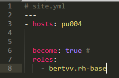

 2. Vervolgens zorgen we ervoor dat alle packages en EPEL-repository geïnstalleerd worden.
 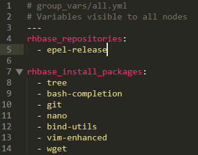

 3. Hierna maken we een gebruikeraccount `robin` aan, deze moet ook een passwoord (hashed) en sudo-rechten toegekend krijgen. Ook zorgen we ervoor dat er een message of the day getoond wordt. Dit gebeurt via:
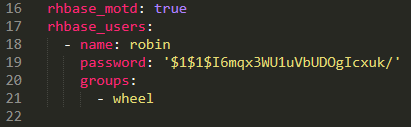

 **Opmerking**: het omzetten van een "tekstpaswoord" naar een paswoord hash gebeurt via het commando `openssl passwd -salt 1 -1 testpassword`. Vervang `testpassword` naar een eigen paswoord naar keuze.
 4. Ten slotte zorgen we ervoor dat gebruiker `robin` via SSH kan inloggen zonder een paswoord in te geven. Typ eerst `keygen.exe` in Git Bash en overschrijf de passphrase (indien deze al bestaat), kies voor een lege/geen passphrase (gewoon <Enter> ingeven).
 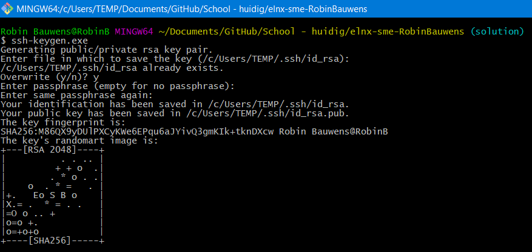
 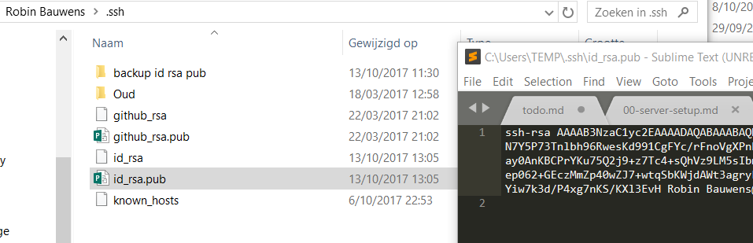
 5. Kopieer de sleutel uit `id_rsa.pub` (TEMP-directory) en plak deze bij `rhbase_ssh_key`, geef ook als `rhbase_ssh_user` de gebruiker `robin` mee.
 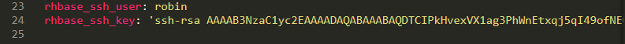
 

## Test report

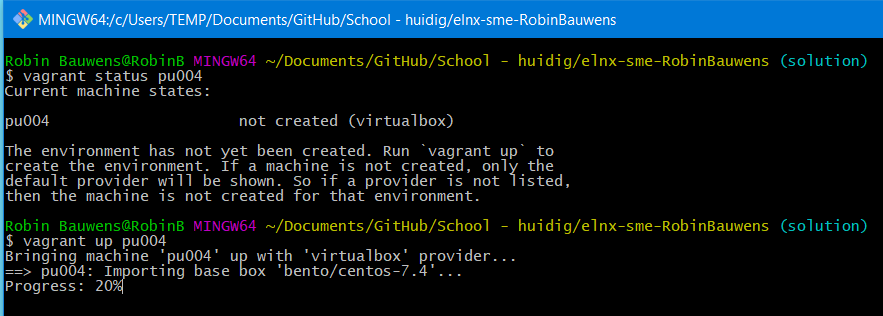

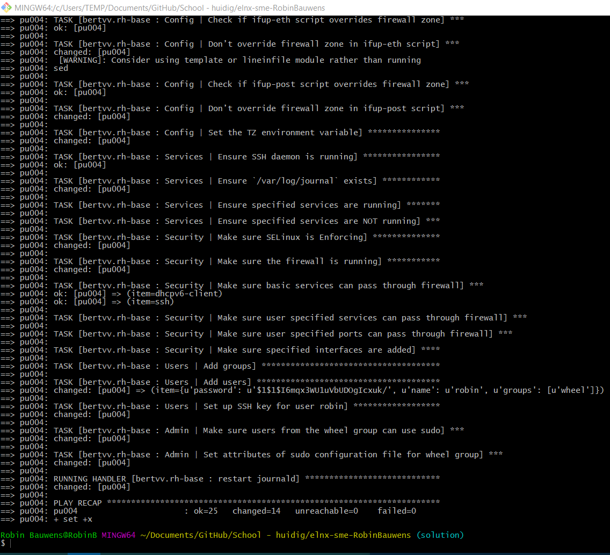

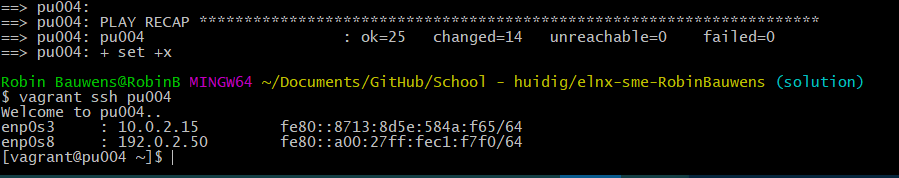

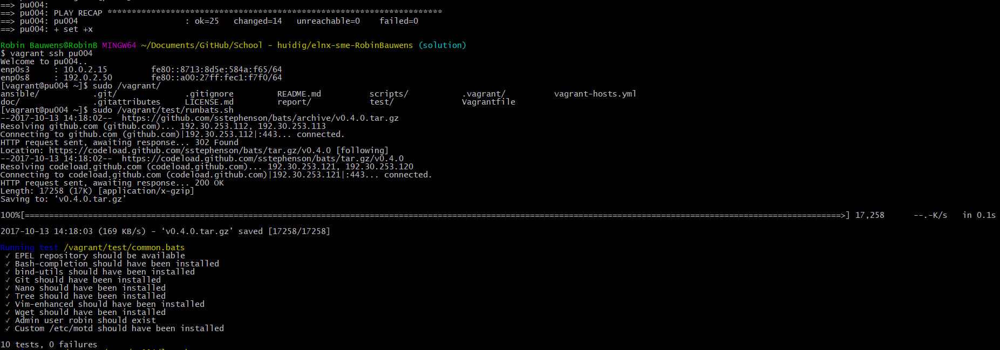

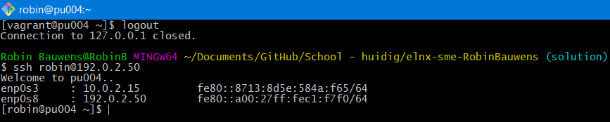

- Je zal eventueel een bestaand `id_rsa.pub` moeten overschrijven indien deze al bestaat. Gebruik dus NIET de `id_rsa.pub` als je nog geen `ssh-keygen.exe` hebt uitgevoerd.


## Resources

- [OpenSSL](https://serverfault.com/questions/574586/what-is-the-purpose-of-openssl-passwd)
- https://wiki.openssl.org/index.php/Manual:Passwd(1)
- [Password hash](https://ma.ttias.be/how-to-generate-a-passwd-password-hash-via-the-command-line-on-linux/)
- [GitHub bertvv.rh-base](https://github.com/bertvv/ansible-role-rh-base)
