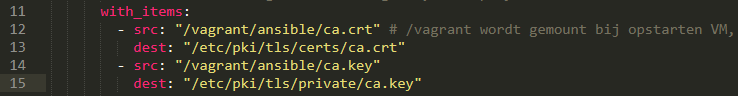

# Enterprise Linux Lab Report

- Student name: Robin Bauwens
- Github repo: <https://github.com/HoGentTIN/elnx-sme-RobinBauwens>

Het opzetten van een LAMP-stack adhv Vagrant en Ansible.

## Test plan

1. Ga naar je working directory van het Github-project.
2. Verwijder de VM met `vagrant destroy -f pu004` indien deze bestaat. Je zou status `not created` moeten krijgen.
3. Voer `vagrant up pu004` uit.
4. Log in op de server met `vagrant ssh pu004` en voer de testen uit (`vagrant/test/runbats.sh`).
Je zou volgende output moeten krijgen:

    ```
    [robin@pu004]$ sudo /vagrant/test/runbats.sh
    Running test /vagrant/test/lamp.bats
     ✓ The necessary packages should be installed
     ✓ The Apache service should be running
     ✓ The Apache service should be started at boot
     ✓ The MariaDB service should be running
     ✓ The MariaDB service should be started at boot
     ✓ The SELinux status should be ‘enforcing’
     ✓ Web traffic should pass through the firewall
     ✓ Mariadb should have a database for Wordpress
     ✓ The MariaDB user should have "write access" to the database
     ✓ The website should be accessible through HTTP
     ✓ The website should be accessible through HTTPS
     ✓ The certificate should not be the default one
     ✓ The Wordpress install page should be visible under http://192.0.2.50/wordpress/                                      
     ✓ MariaDB should not have a test database
     ✓ MariaDB should not have anonymous users


    15 tests, 0 failures
    ```


- Het surfen vanop je hostsysteem naar 192.0.2.50 zou moeten lukken.
    + Typ 192.0.2.50 in je een webbrowser op je hostsysteem.
- Je mag op bij het surfen naar 192.0.2.50 geen certificaatfout krijgen.

## Procedure/Documentation

Describe *in detail* how you completed the assignment, with main focus on the "manual" work. It is of course not necessary to copy/paste your code in this document, but you can refer to it with a hyperlink.

Make sure to write clean Markdown code, so your report looks good and is clearly structured on Github.

1. We voegen de roles van httpd, mariadb en wordpress toe bij de master playbook `site.yml`.
2. We passen de role variables `rhbase_firewall_allow_services` aan zodat webverkeer door de firewall kan passeren. We voegen hier `http` en `https` bij.
3. Vervolgens maken we een MariaDB-databank `wp_db` aan voor Wordpress, tegelijk creëren we ook een gebruiker `wp_user` met een paswoord + genoeg schrijfrechten en zetten we een root password op.
<!-- 4. Hierna voegen we ook toe dat de anonieme gebruikers verwijderd moeten worden (zie ook link onderaan van Ansible docs). 
Is niet nodig, gebeurt automatisch
-->
4. We kunnen nu beginnen met de configuratie van Wordpress, geef o.a. de databanknaam, paswoord, gebruiker en server (host) mee. Ook geven we mee dat de scripting taal PHP is (voor httpd).
5. Voeg ook de interfaces (enp0s3 en enp0s8) toe bij `rhbase_firewall_interfaces`.
6. Hierna kunnen we beginnen aan de configuratie in `site.yml`:
    - Voer eerst volgende commando uit: `yum install mod_ssl openssl`
    
    - Voer vervolgens onderstaande commando's uit (adminrechten nodig):
        + Geef ook enkele instellingen mee (zie afbeelding).

```
openssl genrsa -out ca.key 2048 
openssl req -new -key ca.key -out ca.csr
openssl x509 -req -days 365 -in ca.csr -signkey ca.key -out ca.crt

sudo cp ca.crt /etc/pki/tls/certs
sudo cp ca.key /etc/pki/tls/private/ca.key
sudo cp ca.csr /etc/pki/tls/private/ca.csr

sudo restorecon -RvF /etc/pki

```
 
 

7. Pas hierna de instellingen van `/etc/httpd/conf.d/ssl.conf` aan (met adminrechten).
    

    Veranderen naar:
    

8. Sla de veranderingen op en herstart apache met ` sudo systemctl restart httpd`.
9. Voeg volgende code toe in `site.yml`:
  

10. Hierna kopiëren we (de inhoud van) alle certificaatbestanden naar directory `ansible/`.
  


## Test report

The test report is a transcript of the execution of the test plan, with the actual results. Significant problems you encountered should also be mentioned here, as well as any solutions you found. The test report should clearly prove that you have met the requirements.


**Opmerking:** Voer het testscript uit met adminrechten, anders krijg je volgende foutboodschap:

```
✗ Web traffic should pass through the firewall
   (in test file /vagrant/test/pu004/lamp.bats, line 50)
     `firewall-cmd --list-all | grep 'services.*http\b'' failed
   Authorization failed.
       Make sure polkit agent is running or run the application as superuser.
```

- [Zie ook opmerking over root password, VM eventueel hermaken](https://github.com/bertvv/ansible-role-mariadb)
- Je moet ook zeker SELinux op `enforcing` hebben, anders wordt "Allow Apache to access db over network" niet uitgevoerd, en dan krijg je de boodschap `Error establishing a database connection`. Ook mag [wordpress_database_host niet op localhost staan](https://github.com/bertvv/ansible-role-wordpress/blob/master/tasks/config.yml)
    + Wordpress code moet voor de rest staan (?)


## Resources

- Ansible for DevOps - Jeff Geerling
- [MariaDB privileges](https://dev.mysql.com/doc/refman/5.7/en/privileges-provided.html)
- [Remove all anonymous user accounts](https://docs.ansible.com/ansible/latest/mysql_user_module.html)
- [Poortnummers MariaDB](https://mariadb.com/kb/en/library/configuring-mariadb-for-remote-client-access/)
- [Copy within Ansible](http://docs.ansible.com/ansible/latest/copy_module.html)
- Example copy (pre_tasks): p50 - Chapter 4 - Ansible Playbooks (Jeff Geerling)
- [Copy module - Ansible](http://docs.ansible.com/ansible/latest/copy_module.html)
- [Certificaten CentOS](https://wiki.centos.org/HowTos/Https)
