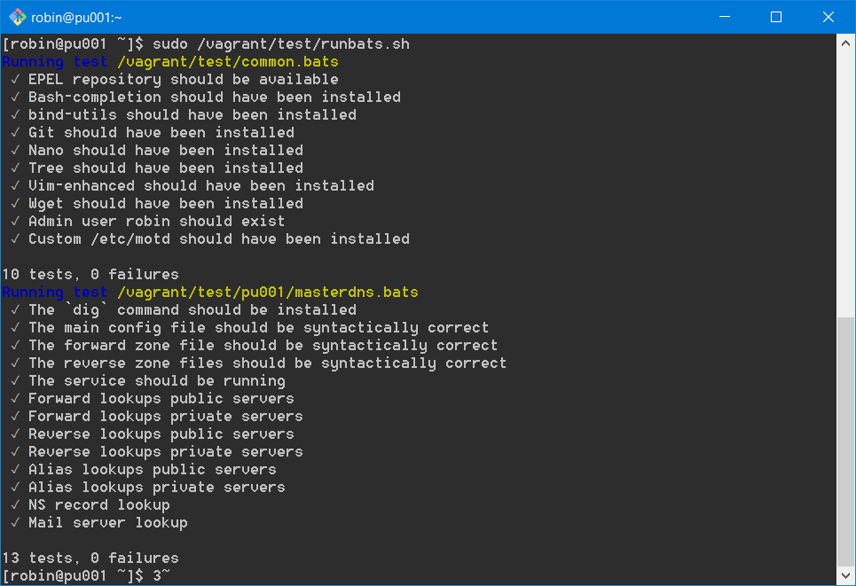
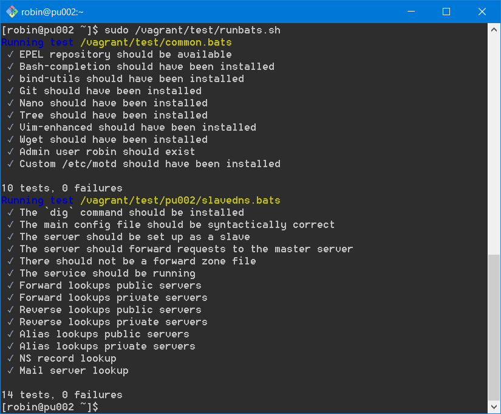
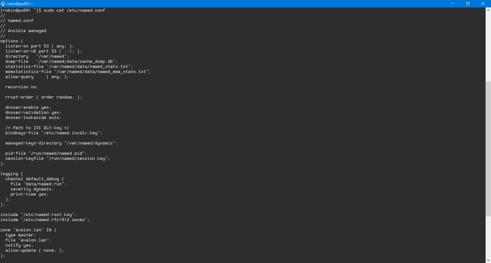
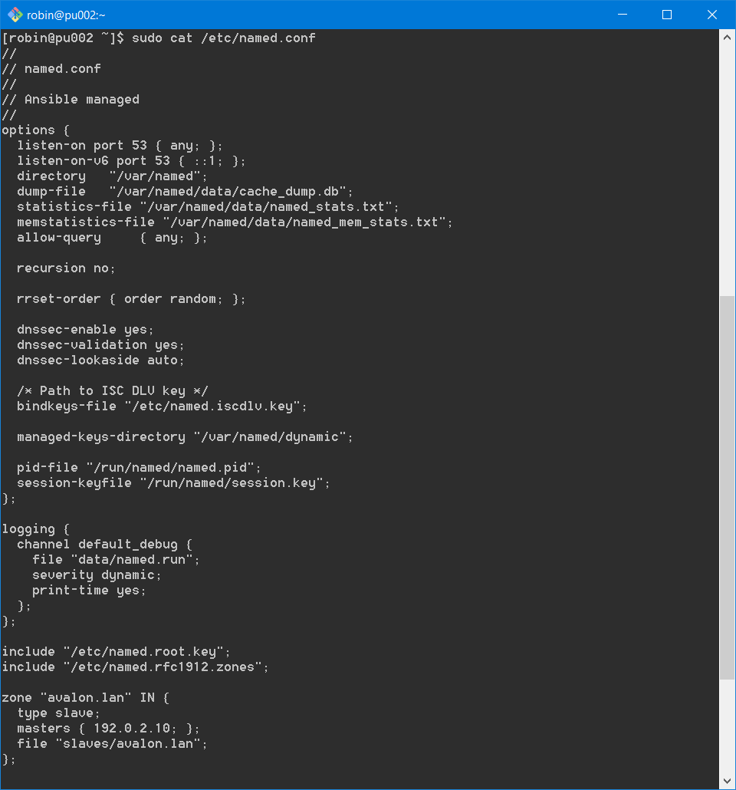
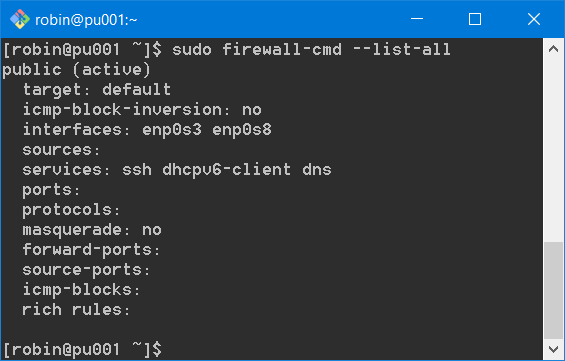
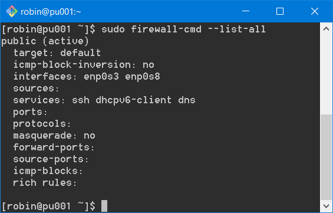

# Enterprise Linux Lab Report

- Student name: Robin Bauwens
- Github repo: <https://github.com/HoGentTIN/elnx-sme-RobinBauwens>

Installatie en configuratie van master- en slave-DNS servers via Vagrant en Ansible.

## Test plan

1. Ga naar je working directory van het Github-project.
2. Verwijder de VM met `vagrant destroy -f pu001` indien deze bestaat. Je zou status `not created` moeten krijgen. Doe hetzelfde voor `pu002`.
3. Voer `vagrant up pu001` uit. Doe hetzelfde voor `pu002`.
4. Log in op de server met `vagrant ssh pu001` en voer de testen uit (`vagrant/test/runbats.sh`). Doe hetzelfde voor `pu002`.

- Je zou volgende output moeten krijgen (voor `pu001`):

    ```
    [robin@pu001]$ sudo /vagrant/test/runbats.sh
     Running test /vagrant/test/pu001/masterdns.bats
     ✓ The `dig` command should be installed
     ✓ The main config file should be syntactically correct
     ✓ The forward zone file should be syntactically correct
     ✓ The reverse zone files should be syntactically correct
     ✓ The service should be running
     ✓ Forward lookups public servers
     ✓ Forward lookups private servers
     ✓ Reverse lookups public servers
     ✓ Reverse lookups private servers
     ✓ Alias lookups public servers
     ✓ Alias lookups private servers
     ✓ NS record lookup
     ✓ Mail server lookup
     ✓ Mail server lookup

    13 tests, 0 failures
    ```

- Je zou volgende output moeten krijgen (voor `pu002`):

  ```
    Running test /vagrant/test/pu002/slavedns.bats
     ✓ The `dig` command should be installed
     ✓ The main config file should be syntactically correct
     ✓ The server should be set up as a slave
     ✓ The server should forward requests to the master server
     ✓ There should not be a forward zone file
     ✓ The service should be running
     ✓ Forward lookups public servers
     ✓ Forward lookups private servers
     ✓ Reverse lookups public servers
     ✓ Reverse lookups private servers
     ✓ Alias lookups public servers
     ✓ Alias lookups private servers
     ✓ NS record lookup
     ✓ Mail server lookup

    14 tests, 0 failures
  ```

- Extra: `/etc/named.conf` (met adminrechten!) zou alle DNS-records moeten bevatten van alle systemen (binnen het netwerk).

## Procedure/Documentation

1. We voegen volgende code onderaan toe aan `vagrant-hosts.yml`:
```
- name: pu001
  ip: 192.0.2.10
- name: pu002
  ip: 192.0.2.11
```
2. Hiernaast voegen we ook bij de master playbook `site.yml` volgende code toe:
```
- hosts: pu001
  roles:
    - bertvv.rh-base
    - bertvv.bind
- hosts: pu002
  roles:
    - bertvv.rh-base # niet vergeten!
    - bertvv.bind
```
3. Vervolgens voegen we onderstaande code toe (zie minimale variabelen) bij `pu001.yml`:
```
---
rhbase_firewall_allow_services: 
  - dns

bind_listen_ipv4:
  - any
bind_allow_query:
  - any

bind_zone_networks:
  - '192.0.2'
  - '172.16'
bind_zone_name: 'avalon.lan'
bind_zone_master_server_ip: 192.0.2.10
bind_zone_name_servers:
  - pu001
  - pu002
bind_zone_hosts:
- name: pu001
  ip: 192.0.2.10
  aliases: 
    - ns1
- name: pu002
  ip: 192.0.2.11
  aliases: 
    - ns2
- name: pu003
  ip: 192.0.2.20
  aliases: 
    - mail
- name: pu004
  ip: 192.0.2.50
  aliases: 
    - www
- name: r001
  ip: 192.0.2.254
  aliases: 
    - gw
- name: pr001
  ip: 172.16.0.2
  aliases: 
    - dhcp
- name: pr002
  ip: 172.16.0.3
  aliases: 
    - directory
- name: pr010
  ip: 172.16.0.10
  aliases: 
    - inside
- name: pr011
  ip: 172.16.0.11
  aliases: 
    - files
bind_zone_mail_servers:
    - name: pu003
      preference: 10
```

Hierin staat alle informatie voor de master-DNS, toelating voor DNS als service, welke servers als mailserver dienen, etc.

Hierna moeten we ook de DNS configureren voor de slave-DNS (**identiek als `pu001.yml`exclusief zone_mail_servers en zone_hosts**):

```
---
rhbase_firewall_allow_services:
  - dns

bind_listen_ipv4:
  - any
bind_allow_query:
  - any

bind_zone_networks:
  - '192.0.2'
  - '172.16'
bind_zone_name: 'avalon.lan'
bind_zone_master_server_ip: 192.0.2.10
bind_zone_name_servers:
  - pu001
  - pu002
  # identiek zelfde als pu001.yml, enkel bind_zone_hosts en bind_zone_mail_servers verwijderen
```

## Test report

- Alle testen slagen op `pu001.yml`


- Alle testen slagen op `pu002.yml`


- `/etc/named.conf` bevat de meegegeven configuratie (via Ansible) op `pu001.yml`:


- `/etc/named.conf` bevat de meegegeven configuratie (via Ansible) op `pu002.yml`:



- `aliases: ns1` werkt niet, gebruik volgende code:

```
aliases: ns1 # zal niet werken

aliases: # zal wel werken
  - ns1
```


- DNS moet toegelaten zijn als service; voeg dit toe bij `rhbase_firewall_allow_services` van de rh-base role.
      + `pu001`
      
      + `pu002`
      


- Destroy en hermaak VM's eens om volledig te testen.

- Role name: bind, service: named -> DNS
- We merken ook op dat het hostsysteem (o.a.) geen alias toegekregen krijgt.

## Resources

- [Bind role ansible](https://github.com/bertvv/ansible-role-bind)