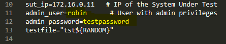
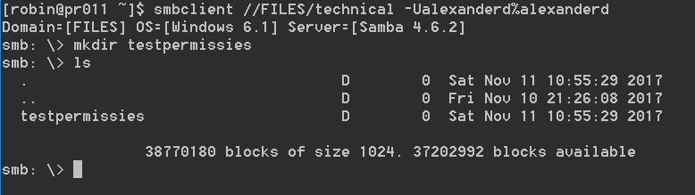

# Enterprise Linux Lab Report

- Student name: Robin Bauwens
- Github repo: <https://github.com/HoGentTIN/elnx-sme-RobinBauwens/tree/solution>

Installeren van Samba voor de (publieke) fileserver met Vagrant en Ansible.

## Test plan

### Samba

**We testen telkens adhv 1 gebruiker (hier: meestal `alexanderd`)**

- Alle gebruikers die niet tot `it`  behoren mogen geen shell-toegang krijgen en alle `it`-gebruikers moeten wel toegang hebben tot de shell.
- De gebruikers moeten toegang hebben tot de shares waarop ze effectief lees- en/of schrijfrechten hebben.
    + We loggen in (in Samba) als `alexanderd` (met paswoord `alexanderd`) en met `smbclient //FILES/technical -Ualexanderd%alexanderd` moeten we leesrechten krijgen, hierna maken we een map aan (binnen de Samba-omgeving) om de schrijfrechten te testen met `mkdir testpermissies`.
- Homedirectories van andere gebruikers moeten zichtbaar zijn (via `smbclient`).
    + We loggen in als `nehirb` en met `smbclient //files/robin -Urobin%testpassword` moeten we de inhoud kunnen zien van admingebruiker `robin` (aanpassen is niet mogelijk).
- De gebruikers dienen lid te zijn van de groepen/business units waartoe ze behoren.
    + We kunnen dit testen door `groups alexanderd` in te voeren en kijken of deze o.a. lid is van `technical` en `public`.
- Een willekeurige gebruiker kan bestanden van andere gebruikers (binnen die business unit) aanpassen.
    + We loggen in als `alexanderd` en met `smbclient //FILES/technical -Ualexanderd%alexanderd` maken we een mapje aan met `mkdir testBusUnit`, vervolgens loggen we in als `anc` (paswoord `anc`) en we loggen ook in op de samba-server met `smbclient //FILES/technical -Uanc%anc`. Hierna kan gebruiker `anc` de mapnaam wijzigen en toegang krijgen binnen deze directory/map.
- Iedere gebruiker kan zijn eigen homefolder aanpassen op de fileserver.
    + We loggen in als `robin` en we kunnen onze eigen homedirectory aanpassen, te testen via `su - robin` (paswoord:testpaswoord) en vervolgens `smbclient //FILES/robin -Urobin%testpassword`, hierna kunnen we bestanden toevoegen.
- Alle shares moeten aanwezig zijn (incl. eigen homedir).
    + We geven volgend commando in: `smbclient -L //FILES/`.
- Alle testscripts dienen te slagen (zie afbeelding).

### VSFTP

Binnen Windows Explorer: `ftp 172.16.0.11`

## Procedure/Documentation

**Opmerking**: pas eerst het testscript `samba.bats` en `vsftp.bats` aan adhv (o.a.) het gebruikte adminaccount (`robin` met paswoord `testpassword`) en eventuele aanpassingen zoals servernaam en workgroup.



### Samba
1. We voegen `pr011` toe bij `site.yml`, we geven deze de rollen van `rh-base` en `samba`. 
2. Hierna voegen we `pr011` ook toe bij `vagrant-hosts.yml`, we geven de server `172.16.0.11` als IP-adres. 
3. Voor deze role hebben we enkele gebruikers en groepen nodig, deze voegen we toe bij de `rh-base`-role. Ook moeten de paswoorden geëncrypteerd zijn, dit doen we op dezelfde manier als in de eerste opdracht. Om het werk te vergemakkelijken heb ik een script geschreven om automatisch de gebruikers te genereren door het uitlezen van het .csv-bestand. De uitvoer van het script kan je direct kopiëren en plakken naar `pr011.yml` (behalve `shell` bij `it`). Het paswoord van de gebruikers is telkens de gebruikersnaam van de persoon.

```
#!/bin/bash
INPUT=../doc/avalon-employees.csv
OLDIFS=$IFS
IFS=,
[ ! -f $INPUT ] && { echo "$INPUT file not found"; exit 99; }
sed 1d $INPUT | while read Number GivenName Surname Username Title Unit Gender StreetAddress Postcode City Country CountryFull TelephoneNumber Birthday
do
        echo "- name: $Username"
        echo "  comment: '$GivenName $Surname $Title'"
        echo "  password: $(openssl passwd -salt 2 -1 $Username)"
        echo "  shell: /sbin/nologin"
        echo "  groups:"
    echo "    - $Unit"
    echo "    - public"
done < $INPUT
IFS=$OLDIFS
```

Ook een kleine scriptje om de gebruikersnamen en paswoorden eruit te halen:
```
#!/bin/bash
INPUT=../doc/avalon-employees.csv
OLDIFS=$IFS
IFS=,
[ ! -f $INPUT ] && { echo "$INPUT file not found"; exit 99; }
sed 1d $INPUT | while read Number GivenName Surname Username Title Unit Gender StreetAddress Postcode City Country CountryFull TelephoneNumber Birthday
do
    echo "  - name: $Username"
    echo "    password: $(echo $Username)"
done < $INPUT
IFS=$OLDIFS
```
4. Voeg dit allemaal toe in `pr011.yml` bij `rhbase_users` en `samba_users`. Voeg bij `all.yml` ook zeker `it` toe als groep bij je eigen gebruikersnaam. Ook bij `pr011.yml` voegen we volgende toe:
```
  - name: robin
    password: testpassword
```
5. Vergeet ook niet om de `samba` en `dns` als toegelaten services te configuren op de firewall. 
6. Hierna maken we ook de groepen aan in `all.yml`. 
7. Vervolgens maken we ook de gebruikers aan die later ook voor Samba gebruikt zullen worden. Deze dienen allemaal lid te zijn van de groep `public` en van de business unit(s) waartoe de gebruiker behoort. Het paswoord moet een gehasht-paswoord zijn, ook mogen de gebruikers van `it` geen beperking op het inloggen krijgen (dit wordt niet behandeld in het generatiescript). 
8. We voegen ook de configuratie van Samba toe, dit bevat o.a. de NetBIOS-naam en workgroup, ondersteuning voor WINS, het toegankelijk maken van de home directories, printers niet gedeeld worden, geen symlinks gemaakt worden in `/var/www/html` en de logbestanden geplaatst worden in `/var/log/samba.log`. 
9. Hierna voegen we de samba shares toe van alle business units met alle rechten die hierbij horen. 
10. Ten slotte kunnen we ook de samba gebruikers aanmaken: voeg telkens de `name` en `password` toe (paswoord is telkens de gebruikersnaam): 

### FTP
Voeg eerst de role `vsftpd` toe aan `site.yml` en voer daarna het script `role-deps.sh` uit in Git Bash.
```
- hosts: pr011
  roles:
    - bertvv.rh-base
    - bertvv.samba
    - bertvv.vsftpd
```


## Test report

### Samba
- Alle gebruikers die niet tot `it`  behoren mogen geen shell-toegang krijgen.

- De gebruikers moeten toegang hebben tot de shares waarop ze effectief lees- en/of schrijfrechten hebben.

- Homedirectories van andere gebruikers moeten zichtbaar zijn (via `smbclient`).
- De gebruikers dienen lid te zijn van de groepen/business units waartoe ze behoren.
- Een willekeurige gebruiker kan bestanden van andere gebruikers (binnen die business unit) aanpassen.
- Iedere gebruiker kan zijn eigen homefolder aanpassen op de fileserver.

- Alle shares moeten aanwezig zijn (incl. eigen homedir).

- Alle testscripts dienen te slagen (zie afbeelding).


### FTP
1. Voeg bij `pr011.yml` ook volgende code toe (om packages te installeren (o.a. `vsftpd`, om de service te starten en toe te laten op de firewall, om een share toe te wijzen (zelfde locatie als bij samba), om anonieme gebruikers te weigeren, om geregistreerde gebruikers toegang te geven en om gefaalde uploads te verwijderen).
```
rhbase_install_packages:
  - vsftpd
  - ftp
  - tree
  - bash-completion
  - git
  - nano
  - bind-utils
  - vim-enhanced
  - wget
rhbase_start_services:
  - vsftpd
rhbase_firewall_allow_services:
  - ftp
  - dns # kan eventueel weggelaten worden
  - samba

vsftpd_local_root: /srv/shares # niet vergeten een plaats te geven (zelfde map als samba)! Geen anon_users

vsftpd_anonymous_enable: no
vsftpd_local_enable: true
vsftpd_options:
  - key: delete_failed_uploads
    value: 'YES'
```

2. De configuratie van Samba zal ook gebruikt worden voor FTP. We moeten enkel nog `directory_mode` toevoegen aangezien we de bestandspermissies nog moeten veranderen. Voeg bij `management`, `sales` en `it` volgende code toe: `directory_mode: 770` (`770` ofwel `'0770'`). Er mogen geen andere gebruikers toegang krijgen tot `management`, `sales` en `it`, en de defaultwaarde staat op `0775`. Met `770` geven we alle `other` gebruikers geen toegang.
3. `management` heeft toegang nodig tot `it` en `sales` en we hebben dit ook gespecifieerd in `pr011.yml` bij `valid_users`, maar we dienen dit ook te specifiëren in `site.yml` voor VSFTP. Dit gebeurt via ACL's. Voeg volgende code toe (onder `hosts: pr011`, als `post_tasks` en niet als `pre_tasks`):
```
  post_tasks:
  - name: ACL IT
    acl:
      path: /srv/shares/it
      entity: management
      etype: group
      permissions: rx
      state: present
  - name: ACL Sales
    acl: 
      path: /srv/shares/sales
      entity: management
      etype: group
      permissions: rx
      state: present
```

### Extra
- Pas op met het herhalen van variabelen, de meest specifieke worden telkens genomen, alle "algemeen gedefineerde variabelen (zie `all.yml`)" worden dan genegeerd!
- Alle gebruikers dienen aangemaakt te worden in `all.yml`.
- Vergeet niet om de share ook te specifiëren bij VSFTP, dit moet dezelfde directory zijn als bij Samba.

## Resources

- [Lezen .csv BASH](https://www.cyberciti.biz/faq/unix-linux-bash-read-comma-separated-cvsfile/)
- [Delete first line while reading](https://stackoverflow.com/questions/9633114/unix-script-to-remove-the-first-line-of-a-csv-file)
- [Reverse string `rev`](https://stackoverflow.com/questions/11461625/reverse-the-order-of-characters-in-a-string)
- [Config SMB](https://www.samba.org/samba/docs/man/manpages-3/smb.conf.5.html)
- [Role SMB](https://github.com/bertvv/ansible-role-samba)
- [Role VSFTPD](https://github.com/bertvv/ansible-role-vsftpd)
- [Manpage config VSFTPD.CONF](http://vsftpd.beasts.org/vsftpd_conf.html)
- [VSFTPD example](https://askubuntu.com/questions/575523/how-to-setup-virtual-users-for-vsftpd-with-access-to-a-specific-sub-directory)
- [VSFTPD example 2](https://github.com/samvera-deprecated/hydradam/wiki/Sample-vsftpd.conf)
- [ACL Ansible](https://docs.ansible.com/ansible/latest/acl_module.html)