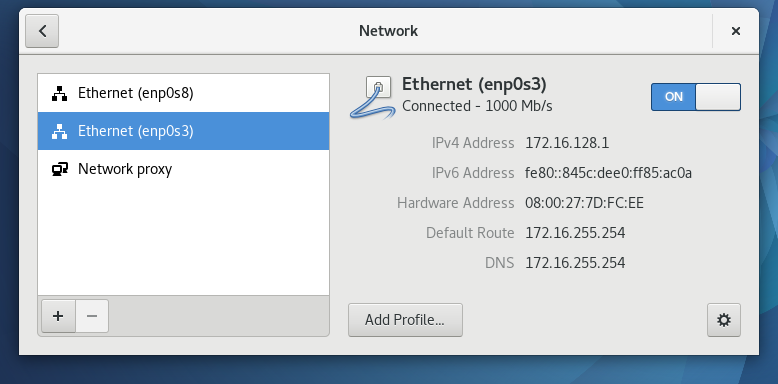
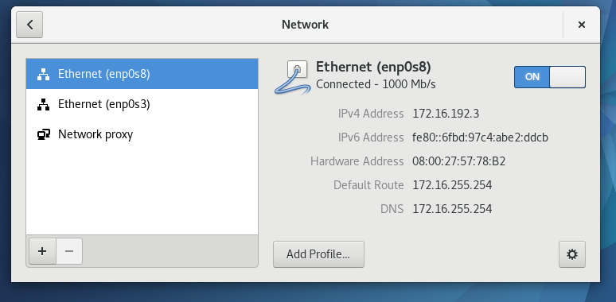

# Enterprise Linux Lab Report

- Student name: Robin Bauwens
- Github repo: <https://github.com/HoGentTIN/elnx-sme-RobinBauwens/tree/solution>

Het opzetten van een server met DHCP en een router via Ansible.

## Test plan

How are you going to verify that the requirements are met? The test plan is a detailed checklist of actions to take, including the expected result for each action, in order to prove your system meets the requirements. Part of this is running the automated tests, but it is not always possible to validate *all* requirements throught these tests.


- De DHCP-service moet correct geconfigureerd zijn.
  - Maak een VM met 2 host-only interfaces (van het netwerk `172.16.0.0/16`). 1 interface moet een IP-adres hebben tussen `172.16.128.1-172.16.191.254`, het ander een IP-adres tussen `172.16.192.1-172.16.255.253`. Ook moeten de DNS-instellingen en default gateway-instellingen meegegeven worden. Dit kan je allemaal controleren in de netwerkinstellingen. Opgelet: voor de implementatie van de routering, zullen de DNS-instellingen nog niet volledig controleerbaar zijn, aangezien de DNS-servers zich in een ander netwerk bevinden.
 
- Verbinding met andere systemen:
  - Het moet mogelijk zijn om de servers (in een ander netwerk) te bereiken. Pingen naar `172.16.0.10` en `192.0.2.10` zou dus geen problemen mogen geven.
  
- Vanaf het werkstation moeten we `avalon.lan` kunnen bereiken, hiernaast zouden we ook `files.avalon.lan` moeten kunnen bereiken (dit toont ook aan dat DNS lukt).
  - Open Firefox (of een andere webbrowser) en surf naar `avalon.lan` en `files.avalon.lan`.

- We kunnen ook het internet bereiken vanaf het werkstation.
  - Open Firefox (of een andere webbrowser) en surf naar `www.hogent.be`.
  
- Als we (vanaf het werkstation) de naam van de webserver opvragen (adhv domeinnaam) dan krijgen we de juiste informatie te zien.
  - Voer `nslookup www.avalon.lan` uit. De uitvoer moet meegeven dat de nameserver `172.16.255.254` is, en dat het adres van `pu004.avalon.lan` `192.0.2.50` is.
  
- De client moet de DNS-server zien als de router-interface.
  - Voer `cat /etc/resolv.conf` uit, hierin moet er staan `nameserver 172.16.255.254`.
  
- De NTP-servers van de router moeten verwijzen naar de Belgische servers, ook moet de timezone op `Europe/Brussels` staan.
  - Voer `show configuration` uit op de router: hierin moet er staan dat de 4 NTP-servers (van 0 t.e.m. 3) gebruikt worden: bvb `3.be.pool.ntp.org`. Voor de tijd op te vragen kan je `show date` gebruiken.
  
- De interfaces van de router zijn correct geconfigureerd (zie tabel):

| Interface | VBox adapter | IP address          | Remarks  |
| :---      | :---         | :---                | :---     |
| `eth0`    | NAT          | 10.0.2.15/24 (DHCP) | WAN link |
| `eth1`    | Host-only    | 192.0.2.254/24      | DMZ      |
| `eth2`    | Host-only    | 172.16.255.254/16   | internal |
  - Dit kan je testen door de configuratie te tonen op de router adhv `show configuration`.

- De routering naar de webserver en het internet verloopt zoals het hoort:
  - Dit kan je testen door `traceroute` uit te voeren naar `www.avalon.lan` en `www.hogent.be`

  

## Procedure/Documentation

### DHCP

1. Voeg de role `bertvv.dhcp` toe in `site.yml`:
```
- hosts: pr001
  roles:
    - bertvv.rh-base
    - bertvv.dhcp
```
2. Voer dan script `role-deps.sh` uit op je hostmachine. Voeg ook volgende code toe bij `vagrant-hosts.yml`:
```
- name: pr001
  ip: 172.16.0.2
```

3. [Voeg code toe](https://github.com/HoGentTIN/elnx-sme-RobinBauwens/blob/solution/ansible/host_vars/pr001.yml) voor `dhcp_global_classes` (om alle MAC-adressen, die uitgedeeld worden door VirtualBox, een IP-adres te geven), de domeinnaam, de standaard uitleentijd, de DNS-servers, DHCP-hosts (adhv MAC-adres) en DHCP-subnets (o.a. netwerkadres, default gateway, begin-, en eindbereik van de pools, en verdere configuratie in te stellen. 
  - We definiëren 1 pool tussen `172.16.128.1-172.16.191.254`: hierin gaan we enkel de IP-adressen uitdelen adhv het MAC-adres (dat meegegeven werd bij `dhcp-hosts`). Daarom zetten we er ook een `deny` op de "`vbox`-klasse" omdat we niet nog eens een IP-adres aan dezelfde interface willen toekennen. 
  - Hiernaast maken we ook een pool voor de hosts waarbij we geen MAC-adres specifiëren. Deze krijgt dan het bereik tussen `172.16.192.1-172.16.255.253`.

4. Om de DHCP-configuratie te testen, maken we een VM met Fedora (adhv LiveCD ISO) en 2 host-only interfaces. We kiezen voor host-only adapter #6 (kan verschillen), dit is voor `172.16.0.1/16`. Hier staat de global class dan op `allow`.

### Router (VyOS)

1. Voer eerst `vagrant plugin install vagrant-vyos` uit in Git Bash.
2. Hierna gaan we [de code](https://github.com/HoGentTIN/elnx-sme-RobinBauwens/blob/solution/scripts/router-config.sh) toevoegen voor de routerconfiguratie.


Describe *in detail* how you completed the assignment, with main focus on the "manual" work. It is of course not necessary to copy/paste your code in this document, but you can refer to it with a hyperlink.

Make sure to write clean Markdown code, so your report looks good and is clearly structured on Github.

## Test report

The test report is a transcript of the execution of the test plan, with the actual results. Significant problems you encountered should also be mentioned here, as well as any solutions you found. The test report should clearly prove that you have met the requirements.

- We kunnen bij de netwerkinstellingen van de VM zien dat we telkens het eerste IP-adres van beide ranges gekregen hebben, namelijk `172.16.128.1` en `172.16.192.1`.



- Host-only adapters van nieuwe VM niet verwarren met adapters van hostmachine! Is adhv host-only adapter #6.
- Bij de pool die de machines voorziet van een IP-adres adhv het (volledig) meegegeven MAC-adres, moet je ook een `deny` zetten op de global class!
- Opmerking: we hebben bij `vagrant-hosts.yml` een IP-adres gegeven maar zonder een /16 als subnetmask. Bij standaard zal Vagrant een /24-adres uitdelen en hierdoor kon de DHCP-role ook een IP-adres uitdelen aan de Fedora-VM (aangezien deze binnen hetzelfde netwerk lagen). Om dit op te lossen moeten we `dhcp_global_domain_name_servers` gebruiken ipv `dhcp_domain_name_servers`. Hier geven we het IP-adres van de DG van het `172.16.0.0/16`-netwerk mee (de router weet, adhv het script, waar de DNS-servers staan en zal dit zelf afhandelen).

## Resources
- [DHCP-role](https://github.com/bertvv/ansible-role-dhcp/tree/tests)
- [BE NTP Pools](http://www.pool.ntp.org/zone/be)
- [Cheat-sheet VyOS](https://github.com/bertvv/cheat-sheets/blob/master/print/VyOS.pdf)
- [Configure NTP-server VyOS](https://rbgeek.wordpress.com/2013/05/14/how-to-configure-ntp-server-and-timezone-on-vyatta/)
- [VyOS User Guide](https://wiki.vyos.net/wiki/User_Guide)
- [DNS Forwarding](https://wiki.vyos.net/wiki/DNS_forwarding)
