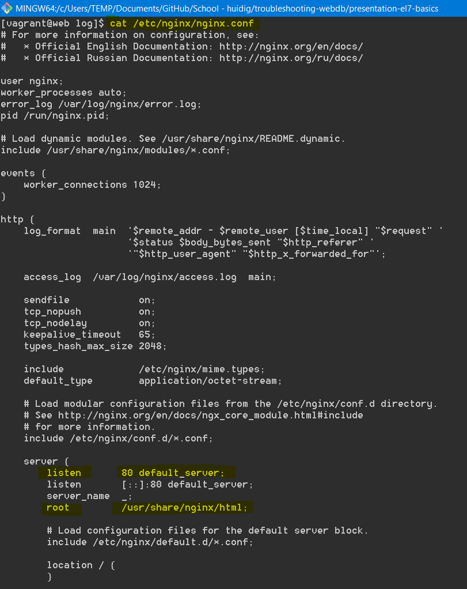
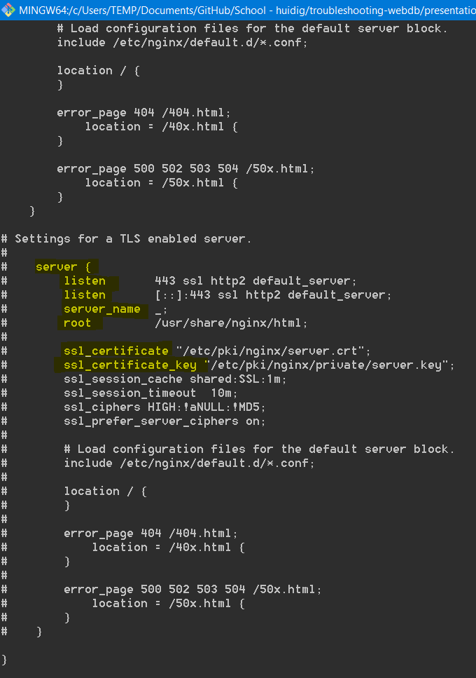

# Cheat sheets and checklists

- Student name: Robin Bauwens
- [Github repo](https://github.com/HoGentTIN/elnx-sme-RobinBauwens)
<!--
## Basic commands


| Task                | Command |
| :---                | :---    |
| Query IP-adress(es) | `ip a`  |


## Git workflow


Simple workflow for a personal project without other contributors:

| Task                                         | Command                   |
| :---                                         | :---                      |
| Current project status                       | `git status`              |
| Select files to be committed                 | `git add FILE...`         |
| Commit changes to local repository           | `git commit -m 'MESSAGE'` |
| Push local changes to remote repository      | `git push`                |
| Pull changes from remote repository to local | `git pull`                |
-->

## TCP/IP

## 1. Checklist data link layer
`Kabels`

- Ben je op de juiste VM bezig?
- Zitten alle **kabels** in (VirtualBox: Network -> Adapter x -> Cable Connected/Enable Network Adapter checkboxes)?
- Juiste interfaces (NAT & Host-Only Adapter)?
- Bij verbinding naar DB, staat VM van DB ook aan?

```
ip link
```
- `UP`: interface is verbonden
- `NO-CARRIER`: geen signaal op interface

[`ip link`](img/cheat-sheet/iplink.PNG)

## 2. Checklist internet layer

`IP-adressering & Subnetmask`, `Default gateway` en `DNS`

- Staan alle IP-adressen en subnetmasks correct?
- Staat de default gateway voor de netwerkinterface juist? + pingen naar DG
- Staat de DNS-server voor de netwerkinterface juist?


Virtualbox:
* NAT: `10.0.2.15/8`
* DG: `10.0.2.2`
* DNS: `10.0.2.3`
* Host-Only: `192.168.56.101` - ` 192.168.56.254/24` 
* Bij opdracht troubleshooting 1: `192.168.56.42`


Pingen van hostsysteem naar `10.0.2.15` zal nooit lukken, de rest wel.

```
ip address
ip route         of route -n

cat /etc/sysconfig/network-scripts/ifcfg-IFACE
sudo systemctl restart network.service   of     nmcli connection reload
cat /etc/resolv.conf

sudo named-checkconf /etc/named.conf     p34 pdf ELNX
nslookup www.hogent.be


sudo systemctl status NetworkManager            is meer transportlaag...

cat /etc/hostname
sudo hostnamectl status
hostnamectl set-hostname <name>
```

[`ip a`](img/cheat-sheet/ip_a.PNG)
[`ip r`](img/cheat-sheet/ip_r.png)
[`cat /etc/resolv.conf`](img/cheat-sheet/ifcfg-resolv.conf.PNG)
[`enp0s3`](img/cheat-sheet/ifcfg-enp0s3.png)
[`enp0s8`](img/cheat-sheet/ifcfg-enp0s8.png)

**`enp0s8` kan soms opstarten zonder IP-adres, is een bug.**

**Herstart `network.service` na wijzigen.**

**Bij Vagrant, check `vagrant-hosts.yml`

[Zeker nagaan of NetworkManager draait!](https://access.redhat.com/documentation/en-us/red_hat_enterprise_linux/7/html/networking_guide/sec-installing_networkmanager)


### Extra:

- Kan je de DG bereiken (via ping)?
- Kan je de DNS-server bereiken?

 ```
 dig www.google.com @10.0.2.3 +short
 nslookup www.google.com
 host www.google.com
 
 traceroute www.google.com
 ```
 
### BIND (DNS)
- `systemd`: `named.service`
- `firewalld`: `dns`

- Role name: bind, service: named -> DNS   `/etc/named.conf`

 
## 3. Checklist transport layer

`Firewall`, `Poorten` en `Services op poorten`

- Draaien de services?
- Draaien de services op de juiste poorten (80 in plaats van 8080 voor HTTP en 443 voor HTTPS)?
- Worden de services toegelaten door de firewall?


```
sudo systemctl status SERVICE
sudo ss -tulpn                       sudo niet vergeten!
sudo ps -ef                         


cat /etc/services                    IANA
getent services <domain>             Implementatie (zoeken naar databank services)
```

[`ss -tulpn`](img/cheat-sheet/ss.PNG)
[`getent services`](img/cheat-sheet/getent.PNG)

```
sudo firewall-cmd --get-services | grep dns

sudo systemctl status httpd.service
sudo systemctl start httpd.service
sudo systemctl enable httpd.service

sudo systemctl --type=service
sudo systemctl --state=running
sudo systemctl --failed


sudo firewall-cmd --list-all
sudo firewall-cmd --add-service=httpd.service
sudo firewall-cmd --add-service=httpd.service --permanent    enkel service OF poortnummer toevoegen
sudo firewall-cmd --add-port=80/tcp --permanent              check later ook httpd.conf in applicatielaag
sudo systemctl restart firewalld

cat /var/log/messages    (hoofdlog)

sudo firewall-cmd --get-active-zones

sudo iptables -L -n -v
```

[`sudo firewall-cmd --list-all`](img/cheat-sheet/firewallcmd.PNG)
[`sudo firewall-cmd --get-active-zones (kan ook enp0s8 bevatten)`](img/cheat-sheet/getactivezones.PNG)


<!---
#### Van buitenaf

```
nmap -A -T4
namp -sS -sU
```
-->

**Controleer ook of panic-mode bij `firewall-cmd` uit staat!**

## 4. Checklist application layer

`Configuratie`

*Vergeet ook niet om service te herstarten!*

**NGINGX:**
- `/var/log/nginx/error.log`

```
sudo journalctl -f -u httpd.service
sudo systemctl restart httpd.service
-> Open een nieuwe terminal voor ieder commando om veranderingen te zien

sudo tail -f /var/log/httpd/error_log

sudo vi /etc/httpd/conf/httpd.conf          ::poortnummer om te zoeken (in vi)
```

- Web: `apachectl configtest`
- Fileserver: `testparm`
- DNS: `named-checkconf`
- DNS: `named-checkzone`
- NGINX: `sudo nginx -t`

**Op te letten bij `nginx`:**




Paden:
`/usr/share/nginx/html/`  `root root`
`/etc/ngingx/nginx.conf`  `root root`


**Op te letten bij `httpd.conf`:**
- `ServerRoot "/etc/httpd"`
- `Listen 80`
- `Include conf.modules.d/*.conf`
- `User apache` en `Group apache`
- `ServerAdmin root@localhost` (mails)
- Servername hoeft niet gedefineerd te zijn: `#ServerName www.example.com:80`

``` 
<Directory />
    AllowOverride none
    Require all denied
</Directory>
```

- `DocumentRoot "/var/www/html"`


Locatie webserver bestanden: `var/www/html/`


[`httpd.conf`](img/cheat-sheet/httpd.conf.PNG)
[`httpd.conf (2)`](img/cheat-sheet/httpd.conf2.PNG)


## SELinux

**Indien je een nieuw bestand aanmaakt in een andere directory (permissies worden niet aangepast bij `mv` -> `resolvecon`)**

``` 
sestatus
getenforce
setenforce Enforcing
reboot

getsebool -a | grep httpd
sudo setsebool can_network_connect_db 1
sudo setsebool can_network_connect_db 1 -P

ls -Z
sudo resolvecon -R .

sudo cat /var/log/audit/audit.log
cat /etc/sysconfig/selinux          permanent maken + targeted is niet voor status zoals enforcing
```

[`restorecon`](img/cheat-sheet/restorecon.PNG)
[`sestatus`](img/cheat-sheet/sestatus.PNG)
[`selinux`](img/cheat-sheet/selinux.PNG)

## Logfiles

```
cat /var/log/messages
cat /var/log/audit/audit.log
cat /var/log/httpd/error_log
cat /var/log/samba/*
cat /var/log/vsftpd/*
```

## VirtualBox configuraties

- NAT-interface: `10.0.2.15/8`
- Host-only interface: `192.168.56.X`

 ### Interfaces (VM EL7)
- enp0s3
- enp0s8

 ### Interfaces VirtualBox
 - `VirtualBox Host-only Ethernet Interface #1`, `VirtualBox Host-only Ethernet Interface #2`, etc.

## DNS (extra)

```
dig www.hogent.be
dig www.hogent.be @a.b.c.d +short
dig -x 178.62.144.90 @193.190.173.1                
```

## Tips voor bekende errors

### No route to host:

- Internetlaag
- Probleem met IP-configuratie

### Connection refused

- Transportlaag
- Service draait niet, firewall, etc.

### Unable to resolve host

- Internet-/applicatielaag
- DNS-server niet beschikbaar

### Error 404

- Applicatielaag
- URL verkeerd, Apache configuratie

###  httpd: Could not reliably determine the server's fully qualified domain name, using 127.0.0.1. Set the 'ServerName' directive globally to suppress this message

- Is geen probleem (zie bronnen onderaan)

TODO: 
- Aan te vullen met hoe op te lossen, welke commando's te controleren
- Notities vrijdag 13/10/17 (les troubleshooting)
- Connectie met hostsysteem
- Bestandspermissies
- Defaultwaarde voor adapters (IP-adressen, welke UP zijn etc.)

## Bereikbaarheid

- `sudo nmap -sS -p 80,443 192.0.2.50` *te testen*

- `wget 192.0.2.50/wordpress`

<!--
## Checklist network configuration

1. Is the IP-adress correct? `ip a`
2. Is the router/default gateway correct? `ip r -n`
3. Is a DNS-server available? `cat /etc/resolv.conf`

-->


## Bronnen

- [Zaken op te letten](https://everythingsysadmin.com/dumb-things-to-check.html)
- [Screencast troubleshooting](https://www.youtube.com/watch?v=ciXpmDwJKOM&feature=youtu.be)
- [Gebruik NAT-interface + Host-only interface](https://bertvv.github.io/notes-to-self/2015/09/29/virtualbox-networking-an-overview/)
- [Apache: could not reliable determine the server's FQDN, using 127.0.0.1.](https://askubuntu.com/questions/256013/apache-error-could-not-reliably-determine-the-servers-fully-qualified-domain-n])
