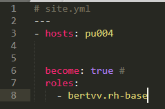
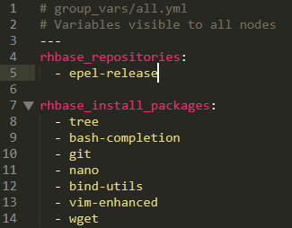
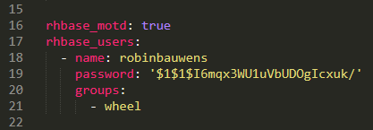
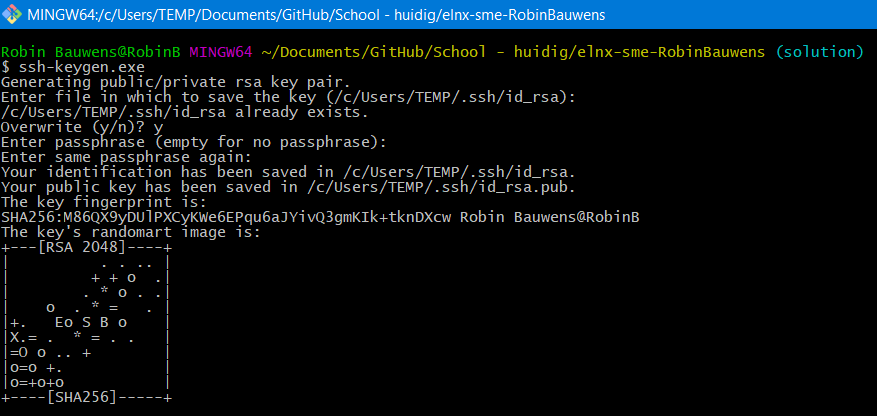
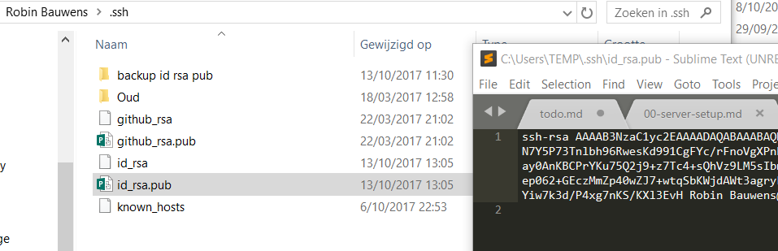
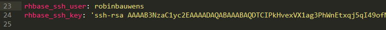

# Enterprise Linux Lab Report

- Student name: Robin Bauwens 
- Github repo: <https://github.com/HoGentTIN/elnxsme-RobinBauwens.git>

Describe the goals of the current iteration/assignment in a short sentence.

## Test plan

How are you going to verify that the requirements are met? The test plan is a detailed checklist of actions to take, including the expected result for each action, in order to prove your system meets the requirements. Part of this is running the automated tests, but it is not always possible to validate *all* requirements throught these tests.

- Bij het inloggen via SSH, mag er geen paswoord gevraagd worden, dit gaan we testen door gewoon in te loggen via SSH en controleren of er geen paswoord gevraagd wordt.
- Alle packages en EPEL-repository moeten geïnstalleerd zijn (controle via script).
- Gebruiker `robinbauwens` moet aangemaakt zijn en administrator zijn (controle via script)
- Het tonen van een motd-bericht bij het inloggen moet plaatsvinden (controle via script)

## Procedure/Documentation

Describe *in detail* how you completed the assignment, with main focus on the "manual" work. It is of course not necessary to copy/paste your code in this document, but you can refer to it with a hyperlink.

Make sure to write clean Markdown code, so your report looks good and is clearly structured on Github.

**Gebruikte roles:**
- `bertvv.rh-base`

1. Eerst voegen we de role `bertvv.rh-base` toe, dit plaatsen we in `site.yml`. 

&nbsp;
2. Vervolgens zorgen we ervoor dat alle packages en EPEL-repository geïnstalleerd worden.

&nbsp;
3. Hierna maken we een gebruikeraccount `robinbauwens` aan, deze moet ook een gehast passwoord en sudo-rechten toegekend krijgen. Ook zorgen we ervoor dat er een message of the day getoond wordt. Dit gebeurt via onderstaande code:

&nbsp;
**Opmerking**: het omzetten van een "tekstpaswoord" naar een paswoord hash gebeurt via het commando `openssl passwd -salt 1 -1 testpassword`. Vervang `testpassword` naar een eigen paswoord naar keuze.
4. Ten slotte zorgen we ervoor dat gebruiker `robinbauwens` via SSH kan inloggen zonder een paswoord in te geven. Type eerst `keygen.exe` in Git Bash en overschrijf de passphrase (indien deze al bestaat), kies voor een lege/geen passphrase (gewoon <Enter> ingeven).

5. Kopieer de sleutel uit `id_rsa.pub` (TEMP-directory) en plak deze bij `rhbase_ssh_key`, geef ook als `rhbase_ssh_user` de gebruiker `robinbauwens` mee.

 

## Test report

The test report is a transcript of the execution of the test plan, with the actual results. Significant problems you encountered should also be mentioned here, as well as any solutions you found. The test report should clearly prove that you have met the requirements.

## Resources

List all sources of useful information that you encountered while completing this assignment: books, manuals, HOWTO's, blog posts, etc.

- [OpenSSL](https://serverfault.com/questions/574586/what-is-the-purpose-of-openssl-passwd)
- https://wiki.openssl.org/index.php/Manual:Passwd(1)
- https://ma.ttias.be/how-to-generate-a-passwd-password-hash-via-the-command-line-on-linux/