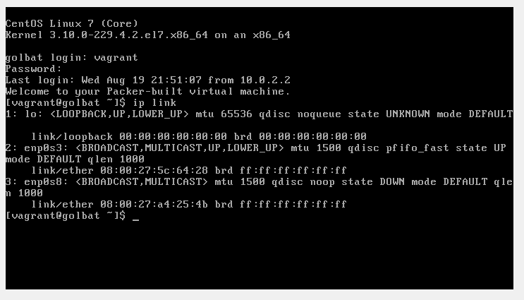
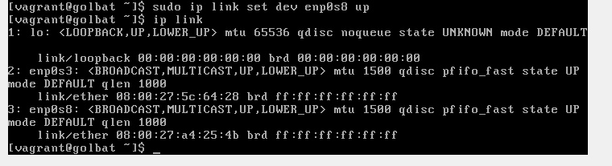
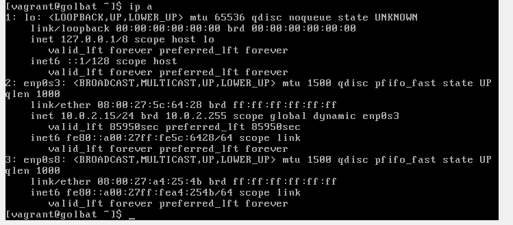
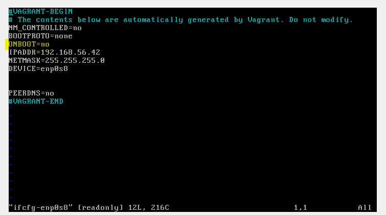
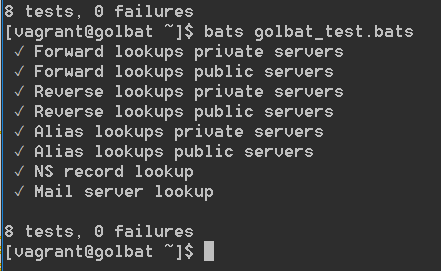
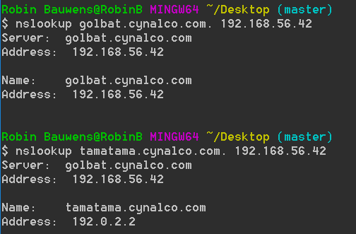
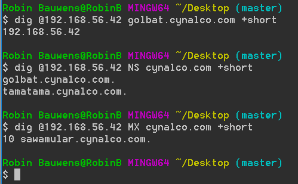
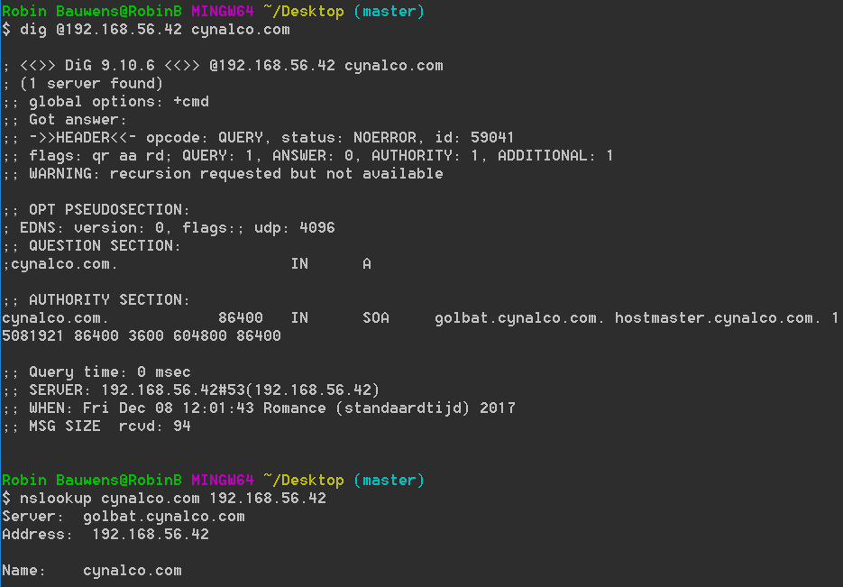
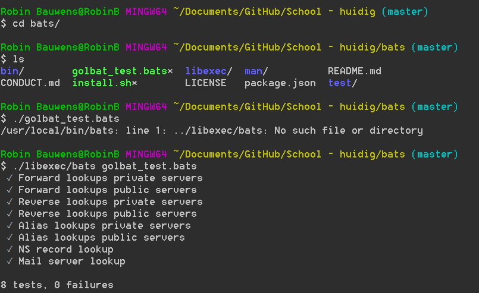

# Enterprise Linux Lab Report - Troubleshooting

- Student name: Robin Bauwens
- Class/group: TIN-TI-3B (Gent)

## Instructions

- Write a detailed report in the "Report" section below (in Dutch or English)
- Use correct Markdown! Use fenced code blocks for commands and their output, terminal transcripts, ...
- The different phases in the bottom-up troubleshooting process are described in their own subsections (heading of level 3, i.e. starting with `###`) with the name of the phase as title.
- Every step is described in detail:
    - describe what is being tested
    - give the command, including options and arguments, needed to execute the test, or the absolute path to the configuration file to be verified
    - give the expected output of the command or content of the configuration file (only the relevant parts are sufficient!)
    - if the actual output is different from the one expected, explain the cause and describe how you fixed this by giving the exact commands or necessary changes to configuration files
- In the section "End result", describe the final state of the service:
    - copy/paste a transcript of running the acceptance tests
    - describe the result of accessing the service from the host system
    - describe any error messages that still remain

Om "problemen" met de toetsenbordindeling te vermijden gebruik dan één van volgende commando's (werkt enkel indien `ssh` toegelaten wordt op poort 22):
-  `vagrant ssh <machinenaam>`
-  `ssh <ip-adres> -l vagrant`

**Opmerking:** `dig` werd ook geïnstalleerd op het hostsysteem om DNS-queries te kunnen sturen naar de VM (om de DNS-functionaliteit te testen).


Eender welk DNS-antwoord is goed (dus ook een negatief, zolang er maar een antwoord is van de server).

Naamgeving:
- `BIND`: DNS Server in Red Hat ELNX
- `named`: DNS-service
- `DNS`: aka `nameserver`

## Report

### Phase 1: Link Layer (TCP/IP)

#### Controleren van netwerkhardware (kabels/poorten)
De kabels moeten aangesloten zijn (en de juiste netwerkadapters gebruikt worden). Meestal 1 NAT en 1 Host-Only adapter (let hierbij op voor `Name` en nummer van Ethernet Adapter).

Met volgend commando controleren we of de kabels insteken en werken (verbonden interfaces), de stroom aanstaat, etc.

`ip link`

We verwachten dat `enp0s3` (NAT) en `enp0s8` (Host-Only adapter) (en `lo`) aanstaan (niet exacte output, minder relevante informatie weggelaten):

```
1: lo: <LOOPBACK,UP,LOWER_UP> ...
2: enp0s3: <BROADCAST,MULTICAST,UP,LOWER_UP> ... state UP ...
3: enp0s8: <BROADCAST,MULTICAST,UP,LOWER_UP> ... state UP ...
```

De output die gegenereerd wordt is als volgt:

```
[vagrant@golbat ~]$ ip link

1: lo: UP, UP
2: enp0s3 UP, UP
3: enp0s8 state DOWN
```



Merk op dat de toestand van `enp0s8` op DOWN staat. Dit gaan we oplossen door deze actief te zetten met `sudo ip link set dev enp0s8 up`.

*Resultaat*: De instellingen voor de toestand van de netwerkadapters zijn nu correct, alle interfaces hebben state UP.



Hiernaast controleren we ook of de instellingen in VirtualBox correct zijn:. Dit controleren we manueel in VirtualBox zelf bij `Preferences` -> `Network`.

*Resultaat:* De instellingen binnen VirtualBox zijn OK, alle kabels zijn ook verbonden en we hebben 1 NAT en 1 Host-Only adapter.

### Phase 2: Internet/Network Layer (TCP/IP)

In deze laag controleren we volgende zaken:

- IP-adres & subnetmask
- Default gateway
- DNS-server

#### IP-adressen en subnetmasks 

Zorg er eerst voor dat het IP-adres van je hostmachine in hetzelfde subnet ligt als die van de VM.
Het IP-adres van `enp0s8` dient `192.168.56.42` te zijn (dit is VirtualBox Host-Only Ethernet Adapter #3 bij mijn instellingen).

*Resultaat:* De instellingen binnen VirtualBox zijn in orde (o.a. Host-Only Ethernet Adapter #3).

Zorg er ook voor dat de firewall van je systeem (hier: Windows Firewall) Echoaanvragen (ICMP) toelaat.

-> Dit is ook in orde.

Via `ip address` testen we de configuratie (ook hier zijn delen weggelaten).
We verwachten volgende uitvoer:

```
ip address
1: lo: <LOOPBACK,UP,LOWER_UP> 
   inet 127.0.0.1/8 scope host lo
2: enp0s3: <BROADCAST,MULTICAST,UP,LOWER_UP> state UP 
    inet 10.0.2.15/24 brd 10.0.2.255 scope global dynamic enp0s3
3: enp0s8: <BROADCAST,MULTICAST,UP,LOWER_UP> state UP 
    inet 192.168.56.42/24 brd 192.168.56.255 scope global enp0s8
```

Indien hier zaken ontbreken/afwijken, kunnen we deze wijzigen in `/etc/sysconfig/network-scripts/ifcfg-IFACE` (met IFACE: `enp0s3` of `enp0s8`) met een teksteditor zoals `vi` (met adminrechten).

De output die gegenereerd wordt is als volgt:



*Resultaat:* Merk op dat (na de activatie via `ip link`) `enp0s8` geen IP-adres toegekend heeft gekregen. Dit kunnen we veranderen in de netwerkconfiguratie(bestanden).

Om dit op te lossen:

`sudo vi /etc/sysconfig/network-scripts/ifcfg-enp0s8` en verander `ONBOOT=no` naar `ONBOOT=yes`.

`:q!` is in QWERTY met shift + L, a, shift &



Vergeet ook niet om `network.service` te herstarten met `sudo systemctl restart network.service`.

Vanaf nu kunnen we `ssh 192.168.56.42 -l vagrant` uitvoeren, merk op dat we eerst `ssh-keygen -R 192.168.56.42` moeten uitvoeren aangezien de vorige VM ook dit IP-adres had.

```
Robin Bauwens@RobinB MINGW64 ~/Desktop (master)
$ ssh 192.168.56.42 -l vagrant
@@@@@@@@@@@@@@@@@@@@@@@@@@@@@@@@@@@@@@@@@@@@@@@@@@@@@@@@@@@
@    WARNING: REMOTE HOST IDENTIFICATION HAS CHANGED!     @
@@@@@@@@@@@@@@@@@@@@@@@@@@@@@@@@@@@@@@@@@@@@@@@@@@@@@@@@@@@
IT IS POSSIBLE THAT SOMEONE IS DOING SOMETHING NASTY!
Someone could be eavesdropping on you right now (man-in-the-middle attack)!
It is also possible that a host key has just been changed.
The fingerprint for the ECDSA key sent by the remote host is
SHA256:W7g/Tsg+fcGXRcq2rF7sJFJgAfGtRsNdJAdqRydXf9E.
Please contact your system administrator.
Add correct host key in /c/Users/TEMP/.ssh/known_hosts to get rid of this message.
Offending ECDSA key in /c/Users/TEMP/.ssh/known_hosts:8
ECDSA host key for 192.168.56.42 has changed and you have requested strict checking.
Host key verification failed.

Robin Bauwens@RobinB MINGW64 ~/Desktop (master)
$ ssh-keygen -R 192.168.56.42
# Host 192.168.56.42 found: line 8
/c/Users/TEMP/.ssh/known_hosts updated.
Original contents retained as /c/Users/TEMP/.ssh/known_hosts.old

Robin Bauwens@RobinB MINGW64 ~/Desktop (master)
$ ssh 192.168.56.42 -l vagrant
The authenticity of host '192.168.56.42 (192.168.56.42)' can't be established.
ECDSA key fingerprint is SHA256:W7g/Tsg+fcGXRcq2rF7sJFJgAfGtRsNdJAdqRydXf9E.
Are you sure you want to continue connecting (yes/no)? yes
Warning: Permanently added '192.168.56.42' (ECDSA) to the list of known hosts.
vagrant@192.168.56.42's password:
Last login: Fri Dec  8 08:19:41 2017
Welcome to your Packer-built virtual machine.
[vagrant@golbat ~]$
```


*Resultaat:* We stellen vast dat alle IP-instellingen nu correct zijn.

```
[vagrant@golbat ~]$ ip a
1: lo: <LOOPBACK,UP,LOWER_UP> mtu 65536 qdisc noqueue state UNKNOWN
    link/loopback 00:00:00:00:00:00 brd 00:00:00:00:00:00
    inet 127.0.0.1/8 scope host lo
       valid_lft forever preferred_lft forever
    inet6 ::1/128 scope host
       valid_lft forever preferred_lft forever
2: enp0s3: <BROADCAST,MULTICAST,UP,LOWER_UP> mtu 1500 qdisc pfifo_fast state UP qlen 1000
    link/ether 08:00:27:5c:64:28 brd ff:ff:ff:ff:ff:ff
    inet 10.0.2.15/24 brd 10.0.2.255 scope global dynamic enp0s3
       valid_lft 86168sec preferred_lft 86168sec
    inet6 fe80::a00:27ff:fe5c:6428/64 scope link
       valid_lft forever preferred_lft forever
3: enp0s8: <BROADCAST,MULTICAST,UP,LOWER_UP> mtu 1500 qdisc pfifo_fast state UP qlen 1000
    link/ether 08:00:27:a4:25:4b brd ff:ff:ff:ff:ff:ff
    inet 192.168.56.42/24 brd 192.168.56.255 scope global enp0s8
       valid_lft forever preferred_lft forever
    inet6 fe80::a00:27ff:fea4:254b/64 scope link
       valid_lft forever preferred_lft forever
```

#### Default gateway
Via `ip route` kunnen we dit nagaan.
We verwachten volgende uitvoer:

```
ip route
default via 10.0.2.2 dev enp0s3 proto static metric 100
10.0.2.0/24 dev enp0s3 proto kernel scope link src 10.0.2.15 metric 100
192.168.56.0/24 dev enp0s8 proto kernel scope link src 192.168.56.42 metric 100
```

Indien hier zaken ontbreken/afwijken, kunnen we dit toevoegen met `ip route add default via 10.0.2.2` en verwijderen met `ip route delete 192.168.56.0/24 dev enp0s8`.

De output die gegenereerd wordt is als volgt (merk ook op dat er een APIPA-adres is, deze laten we staan):

```
[vagrant@golbat ~]$ ip r
default via 10.0.2.2 dev enp0s3  proto static  metric 100
10.0.2.0/24 dev enp0s3  proto kernel  scope link  src 10.0.2.15  metric 100
169.254.0.0/16 dev enp0s8  scope link  metric 1003
192.168.56.0/24 dev enp0s8  proto kernel  scope link  src 192.168.56.42
```

*Resultaat*:
Buiten het feit dat 
<!-- 
`192.168.56.0/24` geen metric heeft (en 
-->
het APIPA-adres er tussen staat zijn de instellingen voor het routeren correct.


Hierna herstarten we beide netwerkservices met `sudo systemctl restart network.service` en `sudo systemctl restart NetworkManager.service` om zeker te zijn dat de netwerkinstellingen correct zijn.

De routeringsinstellingen zijn nu correct.

#### DNS-server
Via `cat /etc/resolv.conf` kunnen we dit nagaan.
We verwachten (ongeveer) volgende uitvoer: `nameserver 10.0.2.3` moet zeker aanwezig zijn aangezien dit een VM is met VirtualBox (met NAT):

```
cat /etc/resolv.conf
# Generated by NetworkManager
search home
nameserver 10.0.2.3
options single-request-reopen
```

We gaan in dit bestand geen aanpassingen maken, aangezien de instellingen al correct staan.

<!--
Vergeet ook hier `network.service` niet eens te herstarten! 
-->

De output die gegenereerd wordt is als volgt:

```
[vagrant@golbat ~]$ cat /etc/resolv.conf
# Generated by NetworkManager
search hogent.be cynalco.com
nameserver 10.0.2.3
```

*Resultaat*: We gebruiken de DNS-server (van VirtualBox), deze instellingen staan goed.

<!--
We zien dat de nameserver correct ingesteld is, hier hoeven we dus niets aan te passen.
-->

#### LAN-connectiviteit nagaan

Indien vorige stappen opgelost/correct geconfigureerd zijn, dan kunnen we de default gateway en een andere host op het LAN pingen. Hiernaast zou DNS name resolution ook geen problemen mogen geven.

Volgende commando's zouden dus probleemloze uitvoer moeten geven (indien pings toegelaten zijn en `dig` geïnstalleerd is op de VM):

```
dig www.google.com @10.0.2.3 +short             Gebruik DNS-server van VirtualBox
ping www.google.com
```

*Resultaat:* 

```
[vagrant@golbat ~]$ dig www.google.com @10.0.2.3 +short
216.58.213.196

-> pings worden niet toegelaten op het schoolnetwerk!
```

We kunnen vanaf de VM een DNS-query sturen naar het internet. We hebben dus al zeker een werkende internetverbinding.


**Opmerking:** We zullen de internetconnectie testen door `bind-utils` te installeren.

```
sudo yum install bind-utils
```

-> Dit hoeft eigenlijk niet aangezien we `dig` al kunnen uitvoeren, maar door `bind-utils` te installeren testen we impliciet op de internetverbinding.

*Resultaat:*

```
[vagrant@golbat ~]$ sudo yum install bind-utils
Loaded plugins: fastestmirror
Repodata is over 2 weeks old. Install yum-cron? Or run: yum makecache fast
base                                                                  | 3.6 kB  00:00:00
extras                                                                | 3.4 kB  00:00:00
updates                                                               | 3.4 kB  00:00:00
(1/4): extras/7/x86_64/primary_db                                     | 130 kB  00:00:00
(2/4): base/7/x86_64/group_gz                                         | 156 kB  00:00:00
(3/4): updates/7/x86_64/primary_db                                    | 4.5 MB  00:00:03
(4/4): base/7/x86_64/primary_db                                       | 5.7 MB  00:00:05
Determining fastest mirrors
 * base: mir01.syntis.net
 * extras: mirror.guru
 * updates: mirror.plusserver.com
Resolving Dependencies
--> Running transaction check
---> Package bind-utils.x86_64 32:9.9.4-18.el7_1.3 will be updated
---> Package bind-utils.x86_64 32:9.9.4-51.el7_4.1 will be an update
--> Processing Dependency: bind-libs = 32:9.9.4-51.el7_4.1 for package: 32:bind-utils-9.9.4-51.el7_4.1.x86_64
--> Processing Dependency: libGeoIP.so.1()(64bit) for package: 32:bind-utils-9.9.4-51.el7_4.1.x86_64
--> Running transaction check
---> Package GeoIP.x86_64 0:1.5.0-11.el7 will be installed
---> Package bind-libs.x86_64 32:9.9.4-18.el7_1.3 will be updated
--> Processing Dependency: bind-libs = 32:9.9.4-18.el7_1.3 for package: 32:bind-9.9.4-18.el7_1.3.x86_64
---> Package bind-libs.x86_64 32:9.9.4-51.el7_4.1 will be an update
--> Processing Dependency: bind-license = 32:9.9.4-51.el7_4.1 for package: 32:bind-libs-9.9.4-51.el7_4.1.x86_64
--> Running transaction check
---> Package bind.x86_64 32:9.9.4-18.el7_1.3 will be updated
---> Package bind.x86_64 32:9.9.4-51.el7_4.1 will be an update
---> Package bind-license.noarch 32:9.9.4-18.el7_1.3 will be updated
--> Processing Dependency: bind-license = 32:9.9.4-18.el7_1.3 for package: 32:bind-libs-lite-9.9.4-18.el7_1.3.x86_64
---> Package bind-license.noarch 32:9.9.4-51.el7_4.1 will be an update
--> Running transaction check
---> Package bind-libs-lite.x86_64 32:9.9.4-18.el7_1.3 will be updated
---> Package bind-libs-lite.x86_64 32:9.9.4-51.el7_4.1 will be an update
--> Finished Dependency Resolution

Dependencies Resolved

=============================================================================================
 Package                 Arch            Version                      Repository        Size
=============================================================================================
Updating:
 bind-utils              x86_64          32:9.9.4-51.el7_4.1          updates          203 k
Installing for dependencies:
 GeoIP                   x86_64          1.5.0-11.el7                 base             1.1 M
Updating for dependencies:
 bind                    x86_64          32:9.9.4-51.el7_4.1          updates          1.8 M
 bind-libs               x86_64          32:9.9.4-51.el7_4.1          updates          1.0 M
 bind-libs-lite          x86_64          32:9.9.4-51.el7_4.1          updates          733 k
 bind-license            noarch          32:9.9.4-51.el7_4.1          updates           84 k

Transaction Summary
=============================================================================================
Install             ( 1 Dependent package)
Upgrade  1 Package  (+4 Dependent packages)

Total download size: 4.8 M
Is this ok [y/d/N]: y
Downloading packages:
Delta RPMs disabled because /usr/bin/applydeltarpm not installed.
(1/6): bind-libs-lite-9.9.4-51.el7_4.1.x86_64.rpm                     | 733 kB  00:00:01
(2/6): bind-license-9.9.4-51.el7_4.1.noarch.rpm                       |  84 kB  00:00:01
(3/6): bind-utils-9.9.4-51.el7_4.1.x86_64.rpm                         | 203 kB  00:00:00
(4/6): GeoIP-1.5.0-11.el7.x86_64.rpm                                  | 1.1 MB  00:00:02
(5/6): bind-libs-9.9.4-51.el7_4.1.x86_64.rpm                          | 1.0 MB  00:00:04
(6/6): bind-9.9.4-51.el7_4.1.x86_64.rpm                               | 1.8 MB  00:00:06
---------------------------------------------------------------------------------------------
Total                                                        815 kB/s | 4.8 MB  00:00:06
Running transaction check
Running transaction test
Transaction test succeeded
Running transaction
  Installing : GeoIP-1.5.0-11.el7.x86_64                                                1/11
  Updating   : 32:bind-license-9.9.4-51.el7_4.1.noarch                                  2/11
  Updating   : 32:bind-libs-9.9.4-51.el7_4.1.x86_64                                     3/11
  Updating   : 32:bind-9.9.4-51.el7_4.1.x86_64                                          4/11
warning: /etc/named.conf created as /etc/named.conf.rpmnew
  Updating   : 32:bind-utils-9.9.4-51.el7_4.1.x86_64                                    5/11
  Updating   : 32:bind-libs-lite-9.9.4-51.el7_4.1.x86_64                                6/11
  Cleanup    : 32:bind-libs-lite-9.9.4-18.el7_1.3.x86_64                                7/11
  Cleanup    : 32:bind-utils-9.9.4-18.el7_1.3.x86_64                                    8/11
  Cleanup    : 32:bind-9.9.4-18.el7_1.3.x86_64                                          9/11
  Cleanup    : 32:bind-libs-9.9.4-18.el7_1.3.x86_64                                    10/11
  Cleanup    : 32:bind-license-9.9.4-18.el7_1.3.noarch                                 11/11
  Verifying  : GeoIP-1.5.0-11.el7.x86_64                                                1/11
  Verifying  : 32:bind-9.9.4-51.el7_4.1.x86_64                                          2/11
  Verifying  : 32:bind-utils-9.9.4-51.el7_4.1.x86_64                                    3/11
  Verifying  : 32:bind-libs-lite-9.9.4-51.el7_4.1.x86_64                                4/11
  Verifying  : 32:bind-libs-9.9.4-51.el7_4.1.x86_64                                     5/11
  Verifying  : 32:bind-license-9.9.4-51.el7_4.1.noarch                                  6/11
  Verifying  : 32:bind-libs-lite-9.9.4-18.el7_1.3.x86_64                                7/11
  Verifying  : 32:bind-utils-9.9.4-18.el7_1.3.x86_64                                    8/11
  Verifying  : 32:bind-license-9.9.4-18.el7_1.3.noarch                                  9/11
  Verifying  : 32:bind-9.9.4-18.el7_1.3.x86_64                                         10/11
  Verifying  : 32:bind-libs-9.9.4-18.el7_1.3.x86_64                                    11/11

Dependency Installed:
  GeoIP.x86_64 0:1.5.0-11.el7

Updated:
  bind-utils.x86_64 32:9.9.4-51.el7_4.1

Dependency Updated:
  bind.x86_64 32:9.9.4-51.el7_4.1                bind-libs.x86_64 32:9.9.4-51.el7_4.1
  bind-libs-lite.x86_64 32:9.9.4-51.el7_4.1      bind-license.noarch 32:9.9.4-51.el7_4.1

Complete!
```

We pingen eens naar de hostmachine (bekijk IP-adres in Windows via `ipconfig`) en naar de DG/DNS-server (van VirtualBox):
```
ping 172.18.172.59                              IP-adres hostsysteem
ping 10.0.2.2
ping 10.0.2.3
```

*Resultaat:*

```
[vagrant@golbat ~]$ ping 172.18.172.59
PING 172.18.172.59 (172.18.172.59) 56(84) bytes of data.
64 bytes from 172.18.172.59: icmp_seq=1 ttl=127 time=0.680 ms
64 bytes from 172.18.172.59: icmp_seq=2 ttl=127 time=1.27 ms
64 bytes from 172.18.172.59: icmp_seq=3 ttl=127 time=1.32 ms
64 bytes from 172.18.172.59: icmp_seq=4 ttl=127 time=1.36 ms
64 bytes from 172.18.172.59: icmp_seq=5 ttl=127 time=1.28 ms
64 bytes from 172.18.172.59: icmp_seq=6 ttl=127 time=1.21 ms
^C
--- 172.18.172.59 ping statistics ---
6 packets transmitted, 6 received, 0% packet loss, time 5012ms
rtt min/avg/max/mdev = 0.680/1.192/1.367/0.235 ms
[vagrant@golbat ~]$ ping 10.0.2.2
PING 10.0.2.2 (10.0.2.2) 56(84) bytes of data.
64 bytes from 10.0.2.2: icmp_seq=1 ttl=64 time=0.139 ms
64 bytes from 10.0.2.2: icmp_seq=2 ttl=64 time=0.410 ms
64 bytes from 10.0.2.2: icmp_seq=3 ttl=64 time=0.411 ms
64 bytes from 10.0.2.2: icmp_seq=4 ttl=64 time=0.177 ms
64 bytes from 10.0.2.2: icmp_seq=5 ttl=64 time=0.262 ms
^C
--- 10.0.2.2 ping statistics ---
5 packets transmitted, 5 received, 0% packet loss, time 4002ms
rtt min/avg/max/mdev = 0.139/0.279/0.411/0.115 ms
[vagrant@golbat ~]$ ping 10.0.2.3
PING 10.0.2.3 (10.0.2.3) 56(84) bytes of data.
64 bytes from 10.0.2.3: icmp_seq=1 ttl=64 time=0.126 ms
64 bytes from 10.0.2.3: icmp_seq=2 ttl=64 time=0.353 ms
64 bytes from 10.0.2.3: icmp_seq=3 ttl=64 time=0.406 ms
64 bytes from 10.0.2.3: icmp_seq=4 ttl=64 time=0.407 ms
64 bytes from 10.0.2.3: icmp_seq=5 ttl=64 time=0.401 ms
64 bytes from 10.0.2.3: icmp_seq=6 ttl=64 time=0.408 ms
64 bytes from 10.0.2.3: icmp_seq=7 ttl=64 time=0.263 ms
^C
--- 10.0.2.3 ping statistics ---
7 packets transmitted, 7 received, 0% packet loss, time 6005ms
rtt min/avg/max/mdev = 0.126/0.337/0.408/0.101 ms
[vagrant@golbat ~]$
```

Ook dit lukt naar de andere kant (Host naar VM; vanuit `cmd` van Windows of via Git Bash):
```
ping 192.168.56.42
```

```
Robin Bauwens@RobinB MINGW64 ~/Desktop (master)
$ ping 192.168.56.42

Pinging 192.168.56.42 with 32 bytes of data:
Reply from 192.168.56.42: bytes=32 time<1ms TTL=64
Reply from 192.168.56.42: bytes=32 time=1ms TTL=64
Reply from 192.168.56.42: bytes=32 time<1ms TTL=64
Reply from 192.168.56.42: bytes=32 time<1ms TTL=64

Ping statistics for 192.168.56.42:
    Packets: Sent = 4, Received = 4, Lost = 0 (0% loss),
Approximate round trip times in milli-seconds:
    Minimum = 0ms, Maximum = 1ms, Average = 0ms
```

*Resultaat:* Alle netwerkinstellingen van de VM zijn correct en we kunnen verbinding maken met het hostsysteem en het internet.

### Phase 3: Transport Layer (TCP/IP)

In deze laag controleren we volgende zaken:

#### Draaien de services?

----
**Opmerking: Alvorens de service op te starten:**

Het kan zijn dat er configuratieproblemen zijn, dit dienen we te controleren in de applicatielaag alhoewel er ook nu al naar verwezen kan worden (zie p34 `syllabus-elnx.pdf`: 3.7.2 DNS troubleshooting).

- Gebruik `sudo named-checkconf /etc/named.conf` om de configuratie van de DNS-server na te gaan. Als er geen fouten zijn in de configuratie, dan zal de uitvoer leeg zijn.

De output die gegenereerd wordt is als volgt:

```
[vagrant@golbat ~]$ sudo named-checkconf /etc/named.conf
[vagrant@golbat ~]$
```

*Resultaat*: We krijgen een lege/geen uitvoer, dit betekent dus de er geen fouten gevonden zijn (qua syntax) in `/etc/named.conf`.

- Gebruik volgende commando's (met andere argumenten; op de master DNS-server) om de zonebestanden te controleren. We verwachten volgende uitvoer (voor andere configuratie):

```
$ sudo named-checkzone cynalco.com /var/named/cynalco.com
zone avalon.lan/IN: loaded serial 17102010
OK

[vagrant@pu001 ~]$ sudo named-checkzone 16.172.in-addr.arpa /var/named/16.172.in-addr.arpa
zone 16.172.in-addr.arpa/IN: loaded serial 17102010
OK
```

De output die gegenereerd wordt is als volgt (voor `192.0.2.0/24` en `192.168.56/24`):

```
[vagrant@golbat ~]$ sudo named-checkzone cynalco.com /var/named/cynalco.com
zone cynalco.com/IN: loaded serial 15081921
OK

[vagrant@golbat ~]$ sudo named-checkzone 2.0.192.in-addr.arpa /var/named/2.0.192.in-addr.arpa
zone 2.0.192.in-addr.arpa/IN: NS 'golbat.cynalco.com.2.0.192.in-addr.arpa' has no address records (A or AAAA)
zone 2.0.192.in-addr.arpa/IN: not loaded due to errors.

[vagrant@golbat ~]$ sudo named-checkzone 56.168.192.in-addr.arpa /var/named/56.168.192.in-addr.arpa
zone 56.168.192.in-addr.arpa/IN: loading from master file /var/named/56.168.192.in-addr.arpa failed: file not found
zone 56.168.192.in-addr.arpa/IN: not loaded due to errors.
```

*Resultaat*: We merken op dat er fouten zitten in `/var/named/2.0.192.in-addr.arpa` en dat het bestand `/var/named/56.168.192.in-addr.arpa` niet bestaat (dit komt omdat de bestandsnaam `192.168.56.in-addr.arpa` een verkeerd formaat heeft, het moet omgekeerd staan "Reverse"). We zullen dit verder oplossen in de applicatielaag aangezien we configuratiebestanden moeten veranderen.


- Foutboodschappen bekijken:

```
$ sudo rndc querylog on
$ sudo journalctl -l -f -u named.service
```

**Opmerking:** We krijgen (een) fout(en) bij het uitvoeren van de voorgaande commando's:

```
[vagrant@golbat ~]$ sudo rndc querylog on
rndc: connect failed: 127.0.0.1#953: connection refused
[vagrant@golbat ~]$ sudo journalctl -l -f -u named.service
-- Logs begin at Fri 2017-12-08 08:19:14 UTC. --
Dec 08 08:19:44 golbat.cynalco.com named-checkconf[1296]: zone 2.0.192.in-addr.arpa/IN: NS 'golbat.cynalco.com.2.0.192.in-addr.arpa' has no address records (A or AAAA)
Dec 08 08:19:44 golbat.cynalco.com named-checkconf[1296]: zone 2.0.192.in-addr.arpa/IN: not loaded due to errors.
Dec 08 08:19:44 golbat.cynalco.com named-checkconf[1296]: _default/2.0.192.in-addr.arpa/IN: bad zone
Dec 08 08:19:44 golbat.cynalco.com systemd[1]: named.service: control process exited, code=exited status=1
Dec 08 08:19:44 golbat.cynalco.com systemd[1]: Unit named.service entered failed state.
Dec 08 08:36:07 golbat.cynalco.com systemd[1]: Unit named.service cannot be reloaded because it is inactive.
Dec 08 08:36:09 golbat.cynalco.com systemd[1]: Unit named.service cannot be reloaded because it is inactive.
Dec 08 08:44:07 golbat.cynalco.com systemd[1]: Unit named.service cannot be reloaded because it is inactive.
Dec 08 08:44:09 golbat.cynalco.com systemd[1]: Unit named.service cannot be reloaded because it is inactive.
Dec 08 08:44:17 golbat.cynalco.com systemd[1]: Unit named.service cannot be reloaded because it is inactive.
```

Hiernaast is het ook handig om `bind-tools` te installeren (dit vond normaal al plaats in de vorige laag): `sudo yum install bind-tools` Enkele commando's om de DNS-server te testen:

```
nslookup www.hogent.be                          IP-adres van www.hogent.be
nslookup www.hogent.be 8.8.8.8                  Met specifieke DNS-server

dig www.hogent.be                               Zoals nslookup, met meer informatie
dig +short www.hogent.be                        Samengevat
dig +short @8.8.8.8 www.hogent.be               Samengevat, met specifieke DNS-server

dig +short NS hogent.be                         Authorative name server voor hogent.be
dig +short AAAA download.fedoraproject.org      IPv6 adres van download.fedoraproject.org

dig +short -x 195.130.131.1                     Reverse lookup
---
$ nslookup www.hogent.be
Server: 195.130.131.1                           Server die antwoordt
Address: 195.130.131.1\#53

Non-authoritative answer:                       Non-authorative: deze server is niet verantwoordelijk voor hogent.be-domein
Name: www.hogent.be                             Server die overeenkomt met www.hogent.be
Address: 178.62.144.90                          
```

Indien `bind-utils` niet geïnstalleerd is, gebruik dan onderstaand commando:

```
$ getent ahosts www.google.com
216.58.208.228  STREAM www.google.com
216.58.208.228  DGRAM
216.58.208.228  RAW
2a00:1450:4007:80e::2004 STREAM
2a00:1450:4007:80e::2004 DGRAM
2a00:1450:4007:80e::2004 RAW
```
----

We verwachten volgende uitvoer (dit wijkt sowieso deels af van de werkelijkheid, wat belangrijk is, is dat de state op active-running staat):

```
[vagrant@DNSServer etc]$ sudo systemctl status named
● named.service - Berkeley Internet Name Domain (DNS)
   Loaded: loaded (/usr/lib/systemd/system/named.service; enabled; vendor preset: disabled)
   Active: active (running) since Sun 2017-12-03 20:01:43 UTC; 24min ago
  Process: 1145 ExecStart=/usr/sbin/named -u named -c ${NAMEDCONF} $OPTIONS (code=exited, sta
tus=0/SUCCESS)
  Process: 1131 ExecStartPre=/bin/bash -c if [ ! "$DISABLE_ZONE_CHECKING" == "yes" ]; then /u
sr/sbin/named-checkconf -z "$NAMEDCONF"; else echo "Checking of zone files is disabled"; fi (
code=exited, status=0/SUCCESS)
 Main PID: 1152 (named)
   CGroup: /system.slice/named.service
           └─1152 /usr/sbin/named -u named -c /etc/named.conf
```

Indien hier de service niet draait, kunnen we dit aanpassen met `sudo systemctl start <service>` en `sudo systemctl enable <service>` (met `<service>` natuurlijk vervangen met een service (zoals `named`).


De output die gegenereerd wordt is als volgt:

```
[vagrant@golbat ~]$ sudo systemctl status named
named.service - Berkeley Internet Name Domain (DNS)
   Loaded: loaded (/usr/lib/systemd/system/named.service; enabled)
   Active: failed (Result: exit-code) since Fri 2017-12-08 08:19:44 UTC; 44min ago

Dec 08 08:19:44 golbat.cynalco.com named-checkconf[1296]: zone 2.0.192.in-addr.arpa/IN: N...)
Dec 08 08:19:44 golbat.cynalco.com named-checkconf[1296]: zone 2.0.192.in-addr.arpa/IN: n....
Dec 08 08:19:44 golbat.cynalco.com named-checkconf[1296]: _default/2.0.192.in-addr.arpa/I...e
Dec 08 08:19:44 golbat.cynalco.com systemd[1]: named.service: control process exited, co...=1
Dec 08 08:19:44 golbat.cynalco.com systemd[1]: Unit named.service entered failed state.
Dec 08 08:36:07 golbat.cynalco.com systemd[1]: Unit named.service cannot be reloaded bec...e.
Dec 08 08:36:09 golbat.cynalco.com systemd[1]: Unit named.service cannot be reloaded bec...e.
Dec 08 08:44:07 golbat.cynalco.com systemd[1]: Unit named.service cannot be reloaded bec...e.
Dec 08 08:44:09 golbat.cynalco.com systemd[1]: Unit named.service cannot be reloaded bec...e.
Dec 08 08:44:17 golbat.cynalco.com systemd[1]: Unit named.service cannot be reloaded bec...e.
Hint: Some lines were ellipsized, use -l to show in full.

[vagrant@golbat ~]$ sudo systemctl start named
Job for named.service failed. See 'systemctl status named.service' and 'journalctl -xn' for details.
```

*Resultaat*: De `named`-service draait niet (want er zijn fouten in de applicatielaag/configuratiebestanden).

<!--
We stellen vast dat de service niet draait op de VM, we corrigeren dit met volgende commando's:
```
[vagrant@nginx network-scripts]$ sudo systemctl status nginx
● nginx.service - The nginx HTTP and reverse proxy server
   Loaded: loaded (/usr/lib/systemd/system/nginx.service; disabled; vendor preset: disabled)
   Active: inactive (dead)
[vagrant@nginx network-scripts]$ sudo systemctl start nginx
sJob for nginx.service failed because the control process exited with error code. See "systemctl status nginx.service" and "journalctl -xe" for details.
```

We merken op dat dit niet lukt, we gaan dus best de logbestanden bekijken van nginx. We krijgen volgende uitvoer:

```
[vagrant@nginx network-scripts]$ sudo journalctl -u nginx
-- Logs begin at vr 2017-10-27 07:32:55 UTC, end at vr 2017-10-27 07:52:00 UTC. --
okt 27 07:51:17 nginx systemd[1]: Starting The nginx HTTP and reverse proxy server...
okt 27 07:51:17 nginx nginx[3312]: nginx: [emerg] BIO_new_file("/etc/pki/tls/certs/nigxn.pem"
okt 27 07:51:17 nginx nginx[3312]: nginx: configuration file /etc/nginx/nginx.conf test faile
okt 27 07:51:17 nginx systemd[1]: nginx.service: control process exited, code=exited status=1
okt 27 07:51:17 nginx systemd[1]: Failed to start The nginx HTTP and reverse proxy server.
okt 27 07:51:17 nginx systemd[1]: Unit nginx.service entered failed state.
okt 27 07:51:17 nginx systemd[1]: nginx.service failed.
```

Er zijn blijkbaar fouten in de configuratiebestanden van de DNS-service `named`. Dit wordt pas later behandeld op de applicatielaag.
-->


#### Draaien de services op de juiste poorten (e.g. 53 of 953 voor DNS)?
We verwachten (ongeveer) volgende uitvoer (gefilterd op `named`):

```
[vagrant@DNSServer etc]$ sudo ss -tulpn | grep named
udp    UNCONN     0      0      192.0.2.10:53                    *:*                   users:(("named",pid=1152,fd=514))
udp    UNCONN     0      0      10.0.2.15:53                    *:*                   users:(("named",pid=1152,fd=513))
udp    UNCONN     0      0      127.0.0.1:53                    *:*                   users:(("named",pid=1152,fd=512))
udp    UNCONN     0      0       ::1:53                   :::*                   users:(("named",pid=1152,fd=515))
tcp    LISTEN     0      10     192.0.2.10:53                    *:*                   users:(("named",pid=1152,fd=23))
tcp    LISTEN     0      10     10.0.2.15:53                    *:*                   users:(("named",pid=1152,fd=22))
tcp    LISTEN     0      10     127.0.0.1:53                    *:*                   users:(("named",pid=1152,fd=21))
tcp    LISTEN     0      128    127.0.0.1:953                   *:*                   users:(("named",pid=1152,fd=25))
tcp    LISTEN     0      10      ::1:53                   :::*                   users:(("named",pid=1152,fd=24))
tcp    LISTEN     0      128     ::1:953                  :::*                   users:(("named",pid=1152,fd=26))
```


De output die gegenereerd wordt is als volgt:

```
[vagrant@golbat ~]$ sudo ss -tulpn | grep named
[vagrant@golbat ~]$
```

*Resultaat*: De service draait nog niet op de poorten, omdat `named` nog niet actief is omwille van configuratiefouten.

#### Worden de services toegelaten door de firewall?
We verwachten (ongeveer) volgende uitvoer:

```
[vagrant@DNSServer etc]$ sudo firewall-cmd --list-all
public (active)
  target: default
  icmp-block-inversion: no
  interfaces: enp0s3 enp0s8
  sources:
  services: ssh dhcpv6-client dns
  ports:
  protocols:
  masquerade: no
  forward-ports:
  source-ports:
  icmp-blocks:
  rich rules:
```

Indien hier een service niet toegelaten is door de firewall, kunnen we volgende commando's gebruiken:
`sudo firewall-cmd --add-service=<service>.service --permanent`  en `sudo firewall-cmd --add-service=<service>.service`.

De output die gegenereerd wordt is als volgt:

```
[vagrant@golbat ~]$ sudo firewall-cmd --list-all
public (default, active)
  interfaces: enp0s3
  sources:
  services: dhcpv6-client ssh
  ports: 53/tcp
  masquerade: no
  forward-ports:
  icmp-blocks:
  rich rules:
```

*Resultaat*: We merken op dat enkel poort 53 gebruikt wordt voor DNS, we kunnen eventueel poort 953 ook toevoegen hiervoor.

<!--
De zone dient ook `public` te zijn voor beide interfaces:

```
[vagrant@pu001 ~]$ sudo firewall-cmd --get-active-zones
public
  interfaces: enp0s3 enp0s8
```

De output die gegenereerd wordt is als volgt:

```

```

*Resultaat*:
-->

Vergeet ook niet om de firewall eens te herstarten met `sudo systemctl restart firewalld`, indien je intellingen hebt gewijzigd.

<!--
#### Bereikbaarheid via `nmap`
Om de bereikbaarheid te testen (vanaf een andere host) kan je volgende commando's gebruiken:

```
[vagrant@DNSSlave ~]$ sudo nmap -sS -p 53,953 192.168.56.42

Starting Nmap 6.40 ( http://nmap.org ) at 2017-12-07 18:55 UTC
Nmap scan report for 192.168.56.42
Host is up (-1500s latency).
PORT    STATE  SERVICE
53/tcp  open   domain
953/tcp closed rndc

Nmap done: 1 IP address (1 host up) scanned in 0.06 seconds
```

De output die gegenereerd wordt is als volgt:

```

```

*Resultaat*:
-->

### Phase 4: Application Layer (TCP/IP)
#### Configuratie (BIND)
In de applicatielaag checken we vooral de configuratie(bestanden van de services).

TIP: open een nieuw terminalvenster en volg alle veranderingen van een service met `sudo journalctl -f -u SERVICE.service` of `sudo tail -f /var/log/httpd/error_log` voor `httpd`.

De logging van BIND gaat naar `var/log/messages` (verdwenen in Fedora).

We controleren eerst of`bind` en `bind-utils` geïnstalleerd zijn, `lwresd` hoeft niet geïnstalleerd te zijn:

```
yum list installed bind
yum info bind

yum list installed bind-utils
yum info bind-utils
```

*Resultaat:* Beide packages zijn geïnstalleerd.

We gaan de configuratie van BIND na met volgend commando.
We verwachten geen uitvoer bij dit commando:

```
sudo named-checkconf
```

De output die gegenereerd wordt is als volgt:

```
[vagrant@golbat ~]$ sudo named-checkconf
[vagrant@golbat ~]$
```

*Resultaat*: Dit betekent dat er geen (syntax)fouten in `/etc/named.conf` zitten.


TIP: De paden waar de (configuratie)bestanden van BIND zich bevinden zijn de volgende:

##### Paden:

<details> 
  <summary>Hoofdconfiguratie (adminrechten!) </summary>
    
```
[vagrant@DNSMaster etc]$ sudo cat /etc/named.conf
//
// named.conf
//
// Ansible managed
//
options {
  listen-on port 53 { any; };
  listen-on-v6 port 53 { ::1; };
  directory   "/var/named";
  dump-file   "/var/named/data/cache_dump.db";
  statistics-file "/var/named/data/named_stats.txt";
  memstatistics-file "/var/named/data/named_mem_stats.txt";
  allow-query     { any; };

  recursion no;

  rrset-order { order random; };

  dnssec-enable yes;
  dnssec-validation yes;
  dnssec-lookaside auto;

  /* Path to ISC DLV key */
  bindkeys-file "/etc/named.iscdlv.key";

  managed-keys-directory "/var/named/dynamic";

  pid-file "/run/named/named.pid";
  session-keyfile "/run/named/session.key";
};

logging {
  channel default_debug {
    file "data/named.run";
    severity dynamic;
    print-time yes;
  };
};

include "/etc/named.root.key";
include "/etc/named.rfc1912.zones";

zone "avalon.lan" IN {
  type master;
  file "avalon.lan";
  notify yes;
  allow-update { none; };
};

zone "2.0.192.in-addr.arpa" IN {
  type master;
  file "2.0.192.in-addr.arpa";
  notify yes;
  allow-update { none; };
};
zone "16.172.in-addr.arpa" IN {
  type master;
  file "16.172.in-addr.arpa";
  notify yes;
  allow-update { none; };
};
```

<!--
```
[vagrant@DNSSlave etc]$ sudo cat /etc/named.conf
//
// named.conf
//
// Ansible managed
//
options {
  listen-on port 53 { any; };
  listen-on-v6 port 53 { ::1; };
  directory   "/var/named";
  dump-file   "/var/named/data/cache_dump.db";
  statistics-file "/var/named/data/named_stats.txt";
  memstatistics-file "/var/named/data/named_mem_stats.txt";
  allow-query     { any; };

  recursion no;

  rrset-order { order random; };

  dnssec-enable yes;
  dnssec-validation yes;
  dnssec-lookaside auto;

  /* Path to ISC DLV key */
  bindkeys-file "/etc/named.iscdlv.key";

  managed-keys-directory "/var/named/dynamic";

  pid-file "/run/named/named.pid";
  session-keyfile "/run/named/session.key";
};

logging {
  channel default_debug {
    file "data/named.run";
    severity dynamic;
    print-time yes;
  };
};

include "/etc/named.root.key";
include "/etc/named.rfc1912.zones";

zone "avalon.lan" IN {
  type slave;
  masters { 192.0.2.10; };
  file "slaves/avalon.lan";
};

zone "2.0.192.in-addr.arpa" IN {
  type slave;
  masters { 192.0.2.10; };
  file "slaves/2.0.192.in-addr.arpa";
};
zone "16.172.in-addr.arpa" IN {
  type slave;
  masters { 192.0.2.10; };
  file "slaves/16.172.in-addr.arpa";
};
```
-->

</details>

- `/etc/named.conf` als je `bind-chroot` hebt geïnstalleerd

<details> 
  <summary>Andere configuratie (adminrechten!) </summary>

```
[root@DNSMaster named]# ls
16.172.in-addr.arpa   avalon.lan  dynamic   named.empty      named.loopback
2.0.192.in-addr.arpa  data        named.ca  named.localhost  slaves
```

```
[root@DNSSlave named]# ls
data  dynamic  named.ca  named.empty  named.localhost  named.loopback  slaves
```
</details>

- `/var/named` (enkel als `root` bereikbaar)

[Klik hier](https://github.com/HoGentTIN/elnx-sme-RobinBauwens/blob/solution/report/named.md) om de inhoud van deze bestanden te zien.

We gaan dus enkele zaken veranderen in `/etc/named.conf` met een teksteditor zoals `vi`, vergeet ook niet om adminrechten mee te geven!

We merken volgende op in `/etc/named.conf`:
```
zone "cynalco.com" IN {
  type master;
  file "cynalco.com";
  notify yes;
  allow-update { none; };
};

zone "192.168.56.in-addr.arpa" IN {
  type master;
  file "192.168.56.in-addr.arpa";
  notify yes;
  allow-update { none; };
};
zone "2.0.192.in-addr.arpa" IN {
  type master;
  file "2.0.192.in-addr.arpa";
  notify yes;
  allow-update { none; };
};
```

We veranderen telkens de config (zie hieronder: `192.168.56 moet 56.168.192` zijn) met `sudo vi /etc/named.conf`.
```
zone "192.168.56.in-addr.arpa" IN {  -> naar:  zone "56.168.192.in-addr.arpa" IN {

file "192.168.56.in-addr.arpa"; -> naar: file "56.168.192.in-addr.arpa";
```

We kunnen de syntax nogmaals checken via volgend commando:

```
sudo named-checkconf
```

*Resultaat:* We zien dat we geen (syntax)fouten gemaakt hebben in `/etc/named.conf`.

```
[vagrant@golbat ~]$ sudo vi /etc/named.conf
[vagrant@golbat ~]$ sudo named-checkconf
```

De hoofdconfiguratie is nu in orde, nu gaan we naar `/var/named/`.
We zien dat `192.168.56.in-addr.arpa` eigenlijk `56.168.192.in-addr.arpa` moet zijn. Verander dit:

```
[vagrant@golbat ~]$ sudo mv /var/named/192.168.56.in-addr.arpa /var/named/56.168.192.in-addr.arpa
```

Open nu het bestand `56.168.192.in-addr.arpa` en verander telkens `192.168.56` naar `56.168.192` met `vi` (met adminrechten). Verander ook de IP-adressen van 12 en 13, deze staan omgewisseld (`beedle` en `butterfree`).

```
$ORIGIN 192.168.56.in-addr.arpa. -> naar: $ORIGIN 56.168.192.in-addr.arpa.

13       IN  PTR  butterfree.cynalco.com. -> naar 12 (stonden omgewisseld)
12       IN  PTR  beedle.cynalco.com.     -> naar 13 (stonden omgewisseld)
```

Open nu het bestand `2.0.192.in-addr.arpa` met `vi` (met adminrechten).

Merk op dat op het einde van `tamatama.cynalco.com` er geen `.` meegegeven werd, dit mag niet! Voeg dus telkens een `.` toe achter iedere server en achter `golbat.cynalco.com` (tweemaal) en `hostmaster.cynalco.com`.
Voeg zeker ook `IN  NS     tamatama.cynalco.com.` toe! `tamatama` is de tweede DNS-server.

*Resultaat:* Enkel de gewijzigde lijnen worden opgeschreven hieronder.

```
@ IN SOA golbat.cynalco.com. hostmaster.cynalco.com. (


IN  NS     golbat.cynalco.com.
IN  NS     tamatama.cynalco.com.


2        IN  PTR  tamatama.cynalco.com.
4        IN  PTR  karakara.cynalco.com.
6        IN  PTR  sawamular.cynalco.com.
```


#### Bestandspermissies
We bekijken of alle bestandspermissies kloppen adhv van [dit voorbeeld](https://github.com/HoGentTIN/elnx-sme-RobinBauwens/blob/solution/report/named.md).

Deze staan allemaal correct:

```
[vagrant@golbat ~]$ sudo ls -Z /var/named
sudo ls -Z /var/named
-rw-r-----. root  named system_u:object_r:named_zone_t:s0 2.0.192.in-addr.arpa
-rw-r-----. root  named system_u:object_r:named_zone_t:s0 56.168.192.in-addr.arpa
-rw-r-----. root  named system_u:object_r:named_zone_t:s0 cynalco.com
drwxrwx---. named named system_u:object_r:named_cache_t:s0 data
drwxrwx---. named named system_u:object_r:named_cache_t:s0 dynamic
-rw-r-----. root  named system_u:object_r:named_conf_t:s0 named.ca
-rw-r-----. root  named system_u:object_r:named_zone_t:s0 named.empty
-rw-r-----. root  named system_u:object_r:named_zone_t:s0 named.localhost
-rw-r-----. root  named system_u:object_r:named_zone_t:s0 named.loopback
drwxrwx---. named named system_u:object_r:named_cache_t:s0 slaves


[vagrant@golbat etc]$ sudo ls -Z /etc | grep named
drwxr-x---. root named system_u:object_r:etc_t:s0       named
-rw-r-----. root named system_u:object_r:named_conf_t:s0 named.conf
-rw-r-----. root named system_u:object_r:etc_t:s0       named.conf.rpmnew
-rw-r--r--. root named system_u:object_r:etc_t:s0       named.iscdlv.key
-rw-r-----. root named system_u:object_r:named_conf_t:s0 named.rfc1912.zones
-rw-r--r--. root named system_u:object_r:etc_t:s0       named.root.key
-rw-r-----. root named system_u:object_r:dnssec_t:s0    rndc.key
```

#### SELinux
We voeren volgend commando uit om na te gaan of SELinux wel degelijk aanstaat (op `enforcing`).
We verwachten deze uitvoer:

```
getenforce
Enforcing
```

Als we dit uitvoeren, krijgen we ook effectief deze uitvoer.

```
[vagrant@golbat etc]$ getenforce
Enforcing
```


Voor `named` hebben we 2 SELinux-booleans (deze mogen op `off` staan):

```
[vagrant@golbat etc]$ getsebool -a | grep named
named_tcp_bind_http_port --> off
named_write_master_zones --> off
```

We hebben alles doorlopen en nu kunnen we terugkeren naar de transportlaag om `named` op te starten.


## Opnieuw doorlopen (TCP/IP)

### Phase 3: Transport Layer (TCP/IP) (2)

We voeren volgende commando's uit om de service te starten:

```
[vagrant@golbat ~]$ sudo systemctl start named
[vagrant@golbat ~]$ sudo systemctl status named
named.service - Berkeley Internet Name Domain (DNS)
   Loaded: loaded (/usr/lib/systemd/system/named.service; enabled)
   Active: active (running) since Fri 2017-12-08 09:42:16 UTC; 8min ago
  Process: 4586 ExecStart=/usr/sbin/named -u named -c ${NAMEDCONF} $OPTIONS (code=exited, status=0/SUCCESS)
  Process: 4583 ExecStartPre=/bin/bash -c if [ ! "$DISABLE_ZONE_CHECKING" == "yes" ]; then /usr/sbin/named-checkconf -z "$NAMEDCONF"; else echo "Checking of zone files is disabled"; fi (code=exited, status=0/SUCCESS)
 Main PID: 4589 (named)
   CGroup: /system.slice/named.service
           └─4589 /usr/sbin/named -u named -c /etc/named.conf

Dec 08 09:42:25 golbat.cynalco.com named[4589]: error (network unreachable) resolving '....53
Dec 08 09:42:25 golbat.cynalco.com named[4589]: error (network unreachable) resolving '....53
Dec 08 09:42:25 golbat.cynalco.com named[4589]: error (network unreachable) resolving '....53
Dec 08 09:42:25 golbat.cynalco.com named[4589]: error (network unreachable) resolving 'd...53
Dec 08 09:42:25 golbat.cynalco.com named[4589]: error (network unreachable) resolving 'd...53
Dec 08 09:42:25 golbat.cynalco.com named[4589]: error (network unreachable) resolving '....53
Dec 08 09:42:25 golbat.cynalco.com named[4589]: error (network unreachable) resolving '....53
Dec 08 09:42:25 golbat.cynalco.com named[4589]: error (network unreachable) resolving '....53
Dec 08 09:42:26 golbat.cynalco.com named[4589]: managed-keys-zone: Unable to fetch DNSKE...ut
Dec 08 09:42:26 golbat.cynalco.com named[4589]: managed-keys-zone: Unable to fetch DNSKE...ut
Hint: Some lines were ellipsized, use -l to show in full.
```

De service staat nu op `active (running)`.

Hierna controleren we de poorten:
```
[vagrant@golbat ~]$ sudo ss -tulpn | grep named
tcp    UNCONN     0      0              127.0.0.1:53                    *:*      users:(("named",4589,515),("named",4589,514))
tcp    UNCONN     0      0                     :::53                   :::*      users:(("named",4589,513),("named",4589,512))
tcp    LISTEN     0      10             127.0.0.1:53                    *:*      users:(("named",4589,22))
tcp    LISTEN     0      128            127.0.0.1:953                   *:*      users:(("named",4589,23))
tcp    LISTEN     0      10                    :::53                   :::*      users:(("named",4589,21))
tcp    LISTEN     0      128                  ::1:953                  :::*      users:(("named",4589,24))
```

Hierbij zien we dat er geen poort openstaat voor `192.168.56.42`, dit betekent dat anderen (buitenaf) niet de server kunnen bereiken, het staat enkel ingesteld voor de loopback-interface(s).

### Phase 4: Application Layer (TCP/IP)

We veranderen de hoofdconfiguratie: `sudo vi /etc/named.conf`.

```
   listen-on port 53 { 127.0.0.1; }; -> listen-on port 53 { any; };
```

Voer nu `sudo systemctl restart named` uit om de service te herstarten (en config opnieuw te laden).

Merk op dat er nu wel een poort openstaat via IP-adres `192.168.56.42`:
```
[vagrant@golbat ~]$ sudo ss -tulpn | grep named
tcp    UNCONN     0      0          192.168.56.42:53                    *:*      users:(("named",4821,519),("named",4821,518))
tcp    UNCONN     0      0              10.0.2.15:53                    *:*      users:(("named",4821,517),("named",4821,516))
tcp    UNCONN     0      0              127.0.0.1:53                    *:*      users:(("named",4821,515),("named",4821,514))
tcp    UNCONN     0      0                     :::53                   :::*      users:(("named",4821,513),("named",4821,512))
tcp    LISTEN     0      10         192.168.56.42:53                    *:*      users:(("named",4821,24))
tcp    LISTEN     0      10             10.0.2.15:53                    *:*      users:(("named",4821,23))
tcp    LISTEN     0      10             127.0.0.1:53                    *:*      users:(("named",4821,22))
tcp    LISTEN     0      128            127.0.0.1:953                   *:*      users:(("named",4821,25))
tcp    LISTEN     0      10                    :::53                   :::*      users:(("named",4821,21))
tcp    LISTEN     0      128                  ::1:953                  :::*      users:(("named",4821,26))
```


Als we het testscript uitvoeren krijgen we nog altijd fouten, dit komt doordat er in `cynalco.com` nog fouten zitten: `butterfree` heeft nog IP-adres .13 ipv .12 en (omgekeerd hetzelfde bij `beedle`). Ook heeft `mankey` nog geen `CNAME`, voeg dit dus toe (zie `files`).

```
butterfree           IN  A      192.168.56.13 -> naar 192.168.56.12
db1                  IN  CNAME  butterfree
beedle               IN  A      192.168.56.12 -> naar 192.168.56.13
db2                  IN  CNAME  beedle


mankey               IN  A      192.168.56.56
files                IN  CNAME  mankey        -> toegevoegd
```


<!--
HOEFT NIET:
Hierna veranderen we de config in `/etc/named.conf`.
```
       listen-on-v6 port 53 { any; }; -> naar listen-on-v6 port 53 { ::1; };
```
-->

We voegen de DNS toe bij de firewall (voor de zekerheid):

```
sudo firewall-cmd --add-service=dns
sudo firewall-cmd --add-service=dns --permanent
```

<!--
  HOEFT NIET:
Hierna voegen we dit toe:
`ZONE=public` bij  `/etc/sysconfig/network-scripts/ifcfg-enp0s8`.
-->

Laatste opgeloste fout waar ik veel tijd bij verloor:
Specifieer ook welke secundaire DNS-server er is (bij `/var/named/cynalco.com`):

```
                     IN  NS     golbat.cynalco.com.
                     IN  NS     tamatama.cynalco.com.
@                    IN  MX     10  sawamular.cynalco.com.
```

Herstart hierna de service met `sudo systemctl restart named` (voor de zekerheid). Doe hetzelfde voor `firewalld`.

## End result


```
[vagrant@golbat ~]$ bats golbat_test.bats
 ✓ Forward lookups private servers
 ✓ Forward lookups public servers
 ✓ Reverse lookups private servers
 ✓ Reverse lookups public servers
 ✓ Alias lookups private servers
 ✓ Alias lookups public servers
 ✓ NS record lookup
 ✓ Mail server lookup

8 tests, 0 failures
```

```
Robin Bauwens@RobinB MINGW64 ~/Desktop (master)
$ dig @192.168.56.42 tamatama.cynalco.com.

; <<>> DiG 9.10.6 <<>> @192.168.56.42 tamatama.cynalco.com.
; (1 server found)
;; global options: +cmd
;; Got answer:
;; ->>HEADER<<- opcode: QUERY, status: NOERROR, id: 12673
;; flags: qr aa rd; QUERY: 1, ANSWER: 1, AUTHORITY: 2, ADDITIONAL: 2
;; WARNING: recursion requested but not available

;; OPT PSEUDOSECTION:
; EDNS: version: 0, flags:; udp: 4096
;; QUESTION SECTION:
;tamatama.cynalco.com.          IN      A

;; ANSWER SECTION:
tamatama.cynalco.com.   604800  IN      A       192.0.2.2

;; AUTHORITY SECTION:
cynalco.com.            604800  IN      NS      golbat.cynalco.com.
cynalco.com.            604800  IN      NS      tamatama.cynalco.com.

;; ADDITIONAL SECTION:
golbat.cynalco.com.     604800  IN      A       192.168.56.42

;; Query time: 0 msec
;; SERVER: 192.168.56.42#53(192.168.56.42)
;; WHEN: Fri Dec 08 11:55:15 Romance (standaardtijd) 2017
;; MSG SIZE  rcvd: 116


Robin Bauwens@RobinB MINGW64 ~/Desktop (master)
$ dig @192.168.56.42 golbat.cynalco.com.

; <<>> DiG 9.10.6 <<>> @192.168.56.42 golbat.cynalco.com.
; (1 server found)
;; global options: +cmd
;; Got answer:
;; ->>HEADER<<- opcode: QUERY, status: NOERROR, id: 36565
;; flags: qr aa rd; QUERY: 1, ANSWER: 1, AUTHORITY: 2, ADDITIONAL: 2
;; WARNING: recursion requested but not available

;; OPT PSEUDOSECTION:
; EDNS: version: 0, flags:; udp: 4096
;; QUESTION SECTION:
;golbat.cynalco.com.            IN      A

;; ANSWER SECTION:
golbat.cynalco.com.     604800  IN      A       192.168.56.42

;; AUTHORITY SECTION:
cynalco.com.            604800  IN      NS      golbat.cynalco.com.
cynalco.com.            604800  IN      NS      tamatama.cynalco.com.

;; ADDITIONAL SECTION:
tamatama.cynalco.com.   604800  IN      A       192.0.2.2

;; Query time: 0 msec
;; SERVER: 192.168.56.42#53(192.168.56.42)
;; WHEN: Fri Dec 08 11:55:32 Romance (standaardtijd) 2017
;; MSG SIZE  rcvd: 116
```



```
Robin Bauwens@RobinB MINGW64 ~/Desktop (master)
$ nslookup golbat.cynalco.com. 192.168.56.42
Server:  golbat.cynalco.com
Address:  192.168.56.42

Name:    golbat.cynalco.com
Address:  192.168.56.42


Robin Bauwens@RobinB MINGW64 ~/Desktop (master)
$ nslookup tamatama.cynalco.com. 192.168.56.42
Server:  golbat.cynalco.com
Address:  192.168.56.42

Name:    tamatama.cynalco.com
Address:  192.0.2.2
```



### Extra:
Uitvoer controle poorten, draaiende service, uitvoeren van `dig` op hostsysteem met verwijzing `@192.168.56.42` naar domein/zone, reverse lookup eventueel etc.:

```
Robin Bauwens@RobinB MINGW64 ~/Desktop (master)
$ dig @192.168.56.42 golbat.cynalco.com +short
192.168.56.42

Robin Bauwens@RobinB MINGW64 ~/Desktop (master)
$ dig @192.168.56.42 NS cynalco.com +short
golbat.cynalco.com.
tamatama.cynalco.com.

Robin Bauwens@RobinB MINGW64 ~/Desktop (master)
$ dig @192.168.56.42 MX cynalco.com +short
10 sawamular.cynalco.com.
```




```
Robin Bauwens@RobinB MINGW64 ~/Desktop (master)
$ dig @192.168.56.42 cynalco.com

; <<>> DiG 9.10.6 <<>> @192.168.56.42 cynalco.com
; (1 server found)
;; global options: +cmd
;; Got answer:
;; ->>HEADER<<- opcode: QUERY, status: NOERROR, id: 59041
;; flags: qr aa rd; QUERY: 1, ANSWER: 0, AUTHORITY: 1, ADDITIONAL: 1
;; WARNING: recursion requested but not available

;; OPT PSEUDOSECTION:
; EDNS: version: 0, flags:; udp: 4096
;; QUESTION SECTION:
;cynalco.com.                   IN      A

;; AUTHORITY SECTION:
cynalco.com.            86400   IN      SOA     golbat.cynalco.com. hostmaster.cynalco.com. 15081921 86400 3600 604800 86400

;; Query time: 0 msec
;; SERVER: 192.168.56.42#53(192.168.56.42)
;; WHEN: Fri Dec 08 12:01:43 Romance (standaardtijd) 2017
;; MSG SIZE  rcvd: 94


Robin Bauwens@RobinB MINGW64 ~/Desktop (master)
$ nslookup cynalco.com 192.168.56.42
Server:  golbat.cynalco.com
Address:  192.168.56.42

Name:    cynalco.com
```




#### Remote execution script
Download `bats` en voer het hierna uit. Download ook het script via FileZilla bvb.

```
$ git clone https://github.com/sstephenson/bats.git
$ cd bats
$ ./install.sh /usr/local

Robin Bauwens@RobinB MINGW64 ~/Documents/GitHub/School - huidig (master)
$ cd bats/

Robin Bauwens@RobinB MINGW64 ~/Documents/GitHub/School - huidig/bats (master)
$ ls
bin/        golbat_test.bats*  libexec/  man/          README.md
CONDUCT.md  install.sh*        LICENSE   package.json  test/

Robin Bauwens@RobinB MINGW64 ~/Documents/GitHub/School - huidig/bats (master)
$ ./golbat_test.bats
/usr/local/bin/bats: line 1: ../libexec/bats: No such file or directory

Robin Bauwens@RobinB MINGW64 ~/Documents/GitHub/School - huidig/bats (master)
$ ./libexec/bats golbat_test.bats
 ✓ Forward lookups private servers
 ✓ Forward lookups public servers
 ✓ Reverse lookups private servers
 ✓ Reverse lookups public servers
 ✓ Alias lookups private servers
 ✓ Alias lookups public servers
 ✓ NS record lookup
 ✓ Mail server lookup

8 tests, 0 failures
```



<!--
**Opmerking**: Het is mogelijk dat `+short` niet ondersteund wordt voor Windows dig.
-->

## Resources

List all sources of useful information that you encountered while completing this assignment: books, manuals, HOWTO's, blog posts, etc.

- [Basic troubleshooting commands EL](https://bertvv.github.io/presentation-el7-basics/)

- [DNS Red Hat ELNX](https://access.redhat.com/documentation/en-us/red_hat_enterprise_linux/6/html/deployment_guide/ch-dns_servers)

- [named conf](https://www.cyberciti.biz/tips/howto-linux-unix-check-dns-file-errors.html)

- [DNS-server](https://unix.stackexchange.com/questions/28941/what-dns-servers-am-i-using)

- [Aanpassen `ip route`](https://www.cyberciti.biz/faq/howto-linux-configuring-default-route-with-ipcommand/)

- Bert Van Vreckem: ELNX Syllabus

- [Ansible bind role bertvv](https://github.com/bertvv/ansible-role-bind)

- [Installed packages](https://serverfault.com/questions/558936/how-to-accurately-check-if-package-is-installed-in-yum)

- [Configuring BIND](https://www.digitalocean.com/community/tutorials/how-to-configure-bind-as-a-private-network-dns-server-on-centos-7)

- [BIND Configuration Files](https://www.centos.org/docs/2/rhl-rg-en-7.2/s1-bind-configuration.html)

- [Troubleshooting guide](https://bertvv.github.io/linux-network-troubleshooting/)

- [BIND logging](http://www.zytrax.com/books/dns/ch7/logging.html)

- [DNS extra info](http://www.tldp.org/HOWTO/DNS-HOWTO-5.html)

- [Port scanner nmap layer](https://stackoverflow.com/questions/47210759/which-layer-in-the-osi-model-does-a-network-scan-work-on)

- [Configuratie firewall](https://www.digitalocean.com/community/tutorials/how-to-set-up-a-firewall-using-firewalld-on-centos-7)

- [Check whether package is installed](https://unix.stackexchange.com/questions/122681/how-can-i-tell-whether-a-package-is-installed-via-yum-in-a-bash-script)

- [Remove package yum](https://access.redhat.com/documentation/en-US/Red_Hat_Enterprise_Linux/6/html/Deployment_Guide/sec-Removing.html)


- [Keygen](https://stackoverflow.com/questions/8654064/ubuntu-ssh-warning-remote-host-identification-has-changed)

- [QWERTY](https://nl.wikipedia.org/wiki/QWERTY)

- [Config interfaces](https://www.centos.org/docs/5/html/Deployment_Guide-en-US/s1-networkscripts-interfaces.html)

- [Linux interfaces up/down](http://mirrors.deepspace6.net/Linux+IPv6-HOWTO/x1028.html)

- [BATS](https://github.com/sstephenson/bats)

- [BIND zones](https://www.centos.org/docs/5/html/Deployment_Guide-en-US/s1-bind-zone.html)

- [List entries domain](https://www.crucial.com.au/blog/2010/03/24/how-to-list-all-dns-recordsentries-for-a-domain-name-in-linux/)

- [Caching](http://www.zytrax.com/books/dns/ch4/#caching)

- [Firewall-cmd](https://forums.fedoraforum.org/showthread.php?289907-firewall-cmd-permanent-adding-an-interface-to-a-zone)

- [Firewall-cmd 2](https://www.digitalocean.com/community/tutorials/how-to-set-up-a-firewall-using-firewalld-on-centos-7)

- [host](https://pubs.vmware.com/bde-2/index.jsp?topic=%2Fcom.vmware.bigdataextensions.admin.doc%2FGUID-6985704B-7176-4071-8CDB-7047CEF5CE71.html)

- [Zone files](https://www.centos.org/docs/5/html/Deployment_Guide-en-US/s1-bind-zone.html)
