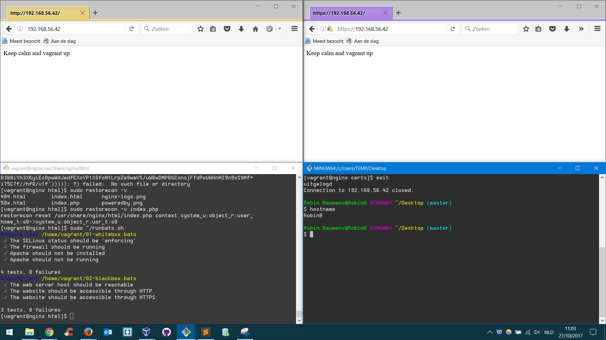

# Enterprise Linux Lab Report - Troubleshooting

- Student name: Robin Bauwens
- Class/group: TIN-TI-3B (Gent)

## Instructions

- Write a detailed report in the "Report" section below (in Dutch or English)
- Use correct Markdown! Use fenced code blocks for commands and their output, terminal transcripts, ...
- The different phases in the bottom-up troubleshooting process are described in their own subsections (heading of level 3, i.e. starting with `###`) with the name of the phase as title.
- Every step is described in detail:
    - describe what is being tested
    - give the command, including options and arguments, needed to execute the test, or the absolute path to the configuration file to be verified
    - give the expected output of the command or content of the configuration file (only the relevant parts are sufficient!)
    - if the actual output is different from the one expected, explain the cause and describe how you fixed this by giving the exact commands or necessary changes to configuration files
- In the section "End result", describe the final state of the service:
    - copy/paste a transcript of running the acceptance tests
    - describe the result of accessing the service from the host system
    - describe any error messages that still remain

## Report

### Phase 1: Link Layer (TCP/IP)

#### Controleren van netwerkhardware (kabels/poorten)
Alvorens het opstarten zien we dat adapter 2 (settings -> network) niet aangesloten is: "Cable connected" is niet aangevinkt.

Oplossing: vink deze checkbox eerst aan.

Met volgend commando controleren we of de kabels insteken en werken (verbonden interfaces), de stroom aanstaat, etc.

`ip link`

We verwachten dat `enp0s3` en `enp0s8` (en `lo`) aanstaan (niet exacte output, minder relevante informatie weggelaten):

```
1: lo: <LOOPBACK,UP,LOWER_UP> ...
2: enp0s3: <BROADCAST,MULTICAST,UP,LOWER_UP> ... state UP ...
3: enp0s8: <BROADCAST,MULTICAST,UP,LOWER_UP> ... state UP ...
```

De output die gegenereerd wordt is als volgt:

```
1: lo: <LOOPBACK,UP,LOWER_UP> mtu 65536 qdisc noqueue state UNKNOWN mode DEFAULT
    link/loopback 00:00:00:00:00:00 brd 00:00:00:00:00:00
2: enp0s3: <BROADCAST,MULTICAST,UP,LOWER_UP> mtu 1500 qdisc pfifo_fast state UP mode DEFAULT qlen 1000
    link/ether 08:00:27:bb:91:b7 brd ff:ff:ff:ff:ff:ff
3: enp0s8: <BROADCAST,MULTICAST,UP,LOWER_UP> mtu 1500 qdisc pfifo_fast state UP mode DEFAULT qlen 1000
    link/ether 08:00:27:b5:4a:be brd ff:ff:ff:ff:ff:ff
```

De instellingen zijn correct, alle interfaces hebben state UP.


Hiernaast controleren we ook of de instellingen in VirtualBox correct zijn: het IP-adres moet `192.168.56.42` zijn. Ook dit is het geval.


### Phase 2: Internet/Network Layer (TCP/IP)

In deze laag controleren we volgende zaken:

- IP-adres & subnetmask
- Default gateway
- DNS-server

#### IP-adressen en subnetmasks 
Via `ip address` testen we de configuratie (ook hier zijn delen weggelaten).
We verwachten volgende uitvoer:

```
ip address
1: lo: <LOOPBACK,UP,LOWER_UP> 
   inet 127.0.0.1/8 scope host lo
2: enp0s3: <BROADCAST,MULTICAST,UP,LOWER_UP> state UP 
    inet 10.0.2.15/24 brd 10.0.2.255 scope global dynamic enp0s3
3: enp0s8: <BROADCAST,MULTICAST,UP,LOWER_UP> state UP 
    inet 192.168.56.42/24 brd 192.168.56.255 scope global enp0s8
```

Indien hier zaken ontbreken/afwijken, kunnen we deze wijzigen in `/etc/sysconfig/network-scripts/ifcfg-IFACE` (met IFACE: `enp0s3` of `enp0s8`) met een teksteditor zoals `vi`. Vergeet ook niet om `network.service` te herstarten met `sudo systemctl restart network.service`.

Dit hoeft niet aangezien we de juiste instellingen toegekregen krijgen.

```
1: lo: <LOOPBACK,UP,LOWER_UP> mtu 65536 qdisc noqueue state UNKNOWN
    link/loopback 00:00:00:00:00:00 brd 00:00:00:00:00:00
    inet 127.0.0.1/8 scope host lo
       valid_lft forever preferred_lft forever
    inet6 ::1/128 scope host
       valid_lft forever preferred_lft forever
2: enp0s3: <BROADCAST,MULTICAST,UP,LOWER_UP> mtu 1500 qdisc pfifo_fast state UP qlen 1000
    link/ether 08:00:27:bb:91:b7 brd ff:ff:ff:ff:ff:ff
    inet 10.0.2.15/24 brd 10.0.2.255 scope global dynamic enp0s3
       valid_lft 86247sec preferred_lft 86247sec
    inet6 fe80::a00:27ff:febb:91b7/64 scope link
       valid_lft forever preferred_lft forever
3: enp0s8: <BROADCAST,MULTICAST,UP,LOWER_UP> mtu 1500 qdisc pfifo_fast state UP qlen 1000
    link/ether 08:00:27:b5:4a:be brd ff:ff:ff:ff:ff:ff
    inet 192.168.56.42/24 brd 192.168.56.255 scope global enp0s8
       valid_lft forever preferred_lft forever
    inet6 fe80::a00:27ff:feb5:4abe/64 scope link
       valid_lft forever preferred_lft forever
```
-> `enp0s8` heeft als IP-adres `192.168.56.42/24` (via Vagrant) en `enp0s3` heeft `10.0.2.15/24`. Dit is in orde.

#### Default gateway
Via `ip route` kunnen we dit nagaan.
We verwachten volgende uitvoer:

```
ip route
default via 10.0.2.2 dev enp0s3 proto static metric 100
10.0.2.0/24 dev enp0s3 proto kernel scope link src 10.0.2.15 metric 100
192.168.56.0/24 dev enp0s8 proto kernel scope link src 192.168.56.42 metric 100
```

Indien hier zaken ontbreken/afwijken, kunnen we dit toevoegen met `ip route add default via 10.0.2.2` en verwijderen met `ip route delete 192.168.56.0/24 dev enp0s8`.

We stellen vast dat er een entry teveel in de config van ip route staat, we verwijderen deze met volgend commando:

```
[vagrant@nginx network-scripts]$ ip r
default via 10.0.2.2 dev enp0s3  proto static  metric 100
10.0.2.0/24 dev enp0s3  proto kernel  scope link  src 10.0.2.15  metric 100
169.254.0.0/16 dev enp0s8  scope link  metric 1003
192.168.56.0/24 dev enp0s8  proto kernel  scope link  src 192.168.56.42
[vagrant@nginx network-scripts]$ sudo ip route delete 169.254.0.0/16 dev enp0s8
[vagrant@nginx network-scripts]$ ip route
default via 10.0.2.2 dev enp0s3  proto static  metric 100
10.0.2.0/24 dev enp0s3  proto kernel  scope link  src 10.0.2.15  metric 100
192.168.56.0/24 dev enp0s8  proto kernel  scope link  src 192.168.56.42
```
Hierna herstarten we beide netwerkservices met `sudo systemctl restart network.service` en `sudo systemctl restart NetworkManager.service` om zeker te zijn dat de netwerkinstellingen correct zijn.

De routeringsinstellingen zijn nu correct.

#### DNS-server
Via `cat /etc/resolv.conf` kunnen we dit nagaan.
We verwachten (ongeveer) volgende uitvoer, `nameserver xxx.xxx.xxx.xxx` moet zeker aanwezig zijn:

```
cat /etc/resolv.conf
# Generated by NetworkManager
search home
nameserver 10.0.2.3
options single-request-reopen
```

We kunnen ook direct aanpassingen maken in dit bestand. Vergeet ook hier `network.service` niet eens te restarten!

We gaan dit na op de VM:
```
[vagrant@nginx network-scripts]$ cat /etc/resolv.conf
# Generated by NetworkManager
search hogent.be
nameserver 10.0.2.3
```

We zien dat de nameserver correct ingesteld is, hier hoeven we dus niets aan te passen.


#### LAN-connectiviteit nagaan

Indien vorige stappen opgelost/correct geconfigureerd zijn, dan kunnen we de default gateway en een andere host op het LAN pingen. Hiernaast zou DNS name resolution ook geen problemen mogen geven.

Volgende commando's zouden dus probleemloze uitvoer moeten geven (indien pings toegelaten zijn en dig geïnstalleerd is op de VM):

```
dig www.google.com @10.0.2.3 +short
ping www.google.com
```

We pingen eens naar de hostmachine (bekijk IP-adres in Windows via `ipconfig`):
```
[vagrant@nginx network-scripts]$ ping 172.18.172.59
PING 172.18.172.59 (172.18.172.59) 56(84) bytes of data.
64 bytes from 172.18.172.59: icmp_seq=1 ttl=127 time=1.60 ms
64 bytes from 172.18.172.59: icmp_seq=2 ttl=127 time=1.41 ms
64 bytes from 172.18.172.59: icmp_seq=3 ttl=127 time=4.90 ms
64 bytes from 172.18.172.59: icmp_seq=4 ttl=127 time=0.832 ms
^C
--- 172.18.172.59 ping statistics ---
4 packets transmitted, 4 received, 0% packet loss, time 3008ms
rtt min/avg/max/mdev = 0.832/2.188/4.900/1.592 ms
```

Ook dit lukt naar de andere kant (Host naar VM):
```
C:\Users\TEMP>ping 192.168.56.42

Pinging 192.168.56.42 with 32 bytes of data:
Reply from 192.168.56.42: bytes=32 time<1ms TTL=64
Reply from 192.168.56.42: bytes=32 time=2ms TTL=64
Reply from 192.168.56.42: bytes=32 time=2ms TTL=64
Reply from 192.168.56.42: bytes=32 time=2ms TTL=64

Ping statistics for 192.168.56.42:
    Packets: Sent = 4, Received = 4, Lost = 0 (0% loss),
Approximate round trip times in milli-seconds:
    Minimum = 0ms, Maximum = 2ms, Average = 1ms

C:\Users\TEMP>
```


### Phase 3: Transport Layer (TCP/IP)

In deze laag controleren we volgende zaken:

#### Draaien de services?
We verwachten volgende uitvoer (dit wijkt sowieso af van de werkelijkheid, wat belangrijk is, is dat de state op active-running staat):

```
sudo systemctl status nginx
● nginx.service - The nginx HTTP and reverse proxy server
   Loaded: loaded (/usr/lib/systemd/system/nginx.service; disabled; vendor preset: disabled)
   Active: active (running) since Thu 2017-10-26 20:07:28 UTC; 5s ago
```
Indien hier de service niet draait, kunnen we dit aanpassen met `sudo systemctl start <service>` en `sudo systemctl enable <service>` (met `<service>` natuurlijk vervangen met een service (zoals `nginx`).


We stellen vast dat de service niet draait op de VM, we corrigeren dit met volgende commando's:
```
[vagrant@nginx network-scripts]$ sudo systemctl status nginx
● nginx.service - The nginx HTTP and reverse proxy server
   Loaded: loaded (/usr/lib/systemd/system/nginx.service; disabled; vendor preset: disabled)
   Active: inactive (dead)
[vagrant@nginx network-scripts]$ sudo systemctl start nginx
sJob for nginx.service failed because the control process exited with error code. See "systemctl status nginx.service" and "journalctl -xe" for details.
```

We merken op dat dit niet lukt, we gaan dus best de logbestanden bekijken van nginx. We krijgen volgende uitvoer:

```
[vagrant@nginx network-scripts]$ sudo journalctl -u nginx
-- Logs begin at vr 2017-10-27 07:32:55 UTC, end at vr 2017-10-27 07:52:00 UTC. --
okt 27 07:51:17 nginx systemd[1]: Starting The nginx HTTP and reverse proxy server...
okt 27 07:51:17 nginx nginx[3312]: nginx: [emerg] BIO_new_file("/etc/pki/tls/certs/nigxn.pem"
okt 27 07:51:17 nginx nginx[3312]: nginx: configuration file /etc/nginx/nginx.conf test faile
okt 27 07:51:17 nginx systemd[1]: nginx.service: control process exited, code=exited status=1
okt 27 07:51:17 nginx systemd[1]: Failed to start The nginx HTTP and reverse proxy server.
okt 27 07:51:17 nginx systemd[1]: Unit nginx.service entered failed state.
okt 27 07:51:17 nginx systemd[1]: nginx.service failed.
```

Er zijn blijkbaar fouten in de configuratiebestanden van nginx. Dit wordt pas behandeld op de applicatielaag.


#### Draaien de services op de juiste poorten (e.g. 80 voor HTTP en 443 voor HTTPS)?
We verwachten (ongeveer) volgende uitvoer (enkel HTTP):

```
sudo ss -tulpn
tcp   LISTEN     0      128             :::80                          :::*                   users:(("nginx",pid=3737,fd=7),("nginx",pid=3736
```

<!--
**Opmerking: om ook HTTPS toe te laten, zetten we dit uit commentaar in `/etc/nginx/nginx.conf`.**
-->

Dit is nog niet het geval, simpelweg omdat nginx nog niet draait omwille van configuratiefouten.
```
[vagrant@nginx certs]$ sudo ss -tulpn
Netid State      Recv-Q Send-Q Local Address:Port               Peer Address:Port            
udp   UNCONN     0      0                *:68                           *:*                   users:(("dhclient",pid=3124,fd=6))
udp   UNCONN     0      0                *:60154                        *:*                   users:(("dhclient",pid=3124,fd=20))
udp   UNCONN     0      0               :::9272                        :::*                   users:(("dhclient",pid=3124,fd=21))
tcp   LISTEN     0      128              *:22                           *:*                   users:(("sshd",pid=1404,fd=3))
tcp   LISTEN     0      100      127.0.0.1:25                           *:*                   users:(("master",pid=2367,fd=13))
tcp   LISTEN     0      128             :::22                          :::*                   users:(("sshd",pid=1404,fd=4))
tcp   LISTEN     0      100            ::1:25                          :::*                   users:(("master",pid=2367,fd=14))
```


#### Worden de services toegelaten door de firewall?
We verwachten (ongeveer) volgende uitvoer:

```
sudo firewall-cmd --list-all
public (active)
  target: default
  icmp-block-inversion: no
  interfaces: enp0s3 enp0s8
  sources:
  services: ssh dhcpv6-client https http
```

Wanneer we dit uitvoeren krijgen we echter volgende uitvoer:
```
[vagrant@nginx certs]$ sudo firewall-cmd --list-all
public (default, active)
  interfaces: enp0s3
  sources:
  services: dhcpv6-client http ssh
  ports:
  masquerade: no
  forward-ports:
  icmp-blocks:
  rich rules:
```

Dit betekent dat https nog niet togelaten werd als service. 

Indien hier de service niet toegelaten is door de firewall, kunnen we volgende commando's gebruiken:
`sudo firewall-cmd --add-service=<service>.service --permanent`  en `sudo firewall-cmd --add-service=<service>.service`.

Dit voeren we dan ook uit:

```
[vagrant@nginx certs]$ sudo firewall-cmd --add-service=https --permanent
success
[vagrant@nginx certs]$ sudo firewall-cmd --add-service=https
success
[vagrant@nginx certs]$ sudo firewall-cmd --list-all
public (default, active)
  interfaces: enp0s3
  sources:
  services: dhcpv6-client http https ssh
  ports:
  masquerade: no
  forward-ports:
  icmp-blocks:
  rich rules:
```

Vergeet ook niet om de firewall te herstarten met `sudo systemctl restart firewalld`.


### Phase 4: Application Layer (TCP/IP)
#### Configuratie (NGINX)
In de applicatielaag checken we vooral de configuratie(bestanden van de services).

TIP: open een nieuw terminalvenster en volg alle veranderingen van een service met `sudo journalctl -f -u nginx.service`.

We gaan eerst de configuratie van NGINX na met volgend commando.
We verwachten volgende uitvoer:
```
sudo nginx -t
nginx: the configuration file /etc/nginx/nginx.conf syntax is ok
nginx: configuration file /etc/nginx/nginx.conf test is successful
```

De paden waar de (configuratie)bestanden van NGINX zich bevinden zijn de volgende:

Paden:
- `/usr/share/nginx/html/`   (web files directory)
- `/etc/nginx/nginx.conf`    (main config file)
- `/var/log/nginx/error.log` (error log file)


We gaan dus enkele zaken veranderen in `/etc/nginx/nginx.conf` met een teksteditor zoals vi, vergeet ook niet om adminrechten mee te geven!

We merken hier op dat HTTPS verkeer niet zal lukken aangezien de poort hiervoor op 8443 staat ipv 443.

```
 server {
      listen 8443 ssl;                                                  !!!
      listen [::]:8443 ssl;                                             !!!
      server_name _;

      ssl_session_cache shared:SSL:50m;
      ssl_session_timeout 5m;

      ssl_certificate_key /etc/pki/tls/private/nginx.key;
      ssl_certificate /etc/pki/tls/certs/nigxn.pem;
```

We veranderen 8443 naar 443 telkens.

We kunnen de syntax nogmaals checken via volgend commando:
```
[vagrant@nginx html]$ sudo nginx -t
nginx: [emerg] BIO_new_file("/etc/pki/tls/certs/nigxn.pem") failed (SSL: error:02001002:system library:fopen:No such file or directory:fopen('/etc/pki/tls/certs/nigxn.pem','r') error:2006D080:BIO routines:BIO_new_file:no such file)
nginx: configuration file /etc/nginx/nginx.conf test failed
```

Blijkbaar bestaat `/etc/pki/tls/certs/nigxn.pem` niet of kan nginx hier niet aan. Dit is ook logisch, want nginx werd verkeerd geschreven.

We corrigeren `nigxn.pem` naar `nginx.pem` en voeren de syntax checker uit.

```
[vagrant@nginx private]$ sudo vi /etc/nginx/nginx.conf
[vagrant@nginx private]$ sudo nginx -t
nginx: the configuration file /etc/nginx/nginx.conf syntax is ok
nginx: configuration file /etc/nginx/nginx.conf test is successful
```


We moeten ook PHP hebben om deze server te laten werken, we controleren dit en zien dat PHP niet geïnstalleerd is, we lossen dit op met volgende commando's:
```
[vagrant@nginx certs]$ php -v
-bash: php: opdracht niet gevonden
[vagrant@nginx certs]$ which php
/usr/bin/which: no php in (/usr/local/bin:/usr/bin:/usr/local/sbin:/usr/sbin:/home/vagrant/.local/bin:/home/vagrant/bin)
[vagrant@nginx certs]$ sudo yum install php
...
(Na de installatie)
[vagrant@nginx certs]$ php -v
PHP 5.4.16 (cli) (built: Nov  6 2016 00:29:02)
Copyright (c) 1997-2013 The PHP Group
Zend Engine v2.4.0, Copyright (c) 1998-2013 Zend Technologies
[vagrant@nginx certs]$ which php
/usr/bin/php
```


#### Verwijderen Apache

We merken op dat Apache geïnstalleerd is, dit mag niet het geval zijn dus verwijderen we deze.

```
[vagrant@nginx ~]$ sudo yum list installed httpd
Geïnstalleerde pakketten
httpd.x86_64                          2.4.6-67.el7.centos.6                          @updates
[vagrant@nginx ~]$ sudo yum remove httpd
Oplossen van afhankelijkheden
--> Transactiecontrole uitvoeren

...

Verwijderd:
  httpd.x86_64 0:2.4.6-67.el7.centos.6

Afhankelijkheid verwijderd:
  apr.x86_64 0:1.4.8-3.el7                            apr-util.x86_64 0:1.5.2-6.el7
  httpd-tools.x86_64 0:2.4.6-67.el7.centos.6          mailcap.noarch 0:2.1.41-2.el7
  php.x86_64 0:5.4.16-42.el7                          php-cli.x86_64 0:5.4.16-42.el7

Compleet!
```


<!--

```
#### Configuratie PHP

We kunnen controleren of PHP geïnstalleerd is met volgende commando's:
Verwacht uitvoer (ongeveer):

```
php -v
PHP 5.4.16 (cli) (built: Nov  6 2016 00:29:02)
Copyright (c) 1997-2013 The PHP Group
Zend Engine v2.4.0, Copyright (c) 1998-2013 Zend Technologies

which php
/usr/bin/php
```
-->

#### SELinux
We voeren volgend commando uit om na te gaan of SELinux wel degelijk aanstaat (op `enforcing`).
We verwachten deze uitvoer:

```
getenforce
Enforcing
```

Als we dit uitvoeren, krijgen we ook effectief deze uitvoer.

<!--
Indien deze niet op `enforcing` staat, kunnen we dit aanpassen met `setenforce Enforcing`. Om dit permanent te maken dienen we het bestand `/etc/sysconfig/selinux` aan te passen met een teksteditor naar keuze.
-->

Als we de booleans van SELinux opvragen, stellen we vast dat `httpd_can_network_connect --> off` op "off" staat. Dit corrigeren we door volgende commando's in te geven:

```
[vagrant@nginx ~]$ sudo setsebool httpd_can_network_connect 1
[vagrant@nginx ~]$ sudo setsebool httpd_can_network_connect 1 -P
```

Ook moeten we ervoor zorgen dat de context voor de (configuratie)bestanden (en keys) wel degelijk juist is, we kunnen dit controleren met `ls -Z`. Dit kunnen we dan oplossen door `sudo resolvecon -R .` uit te voeren in `/etc/pki/tls`.

Dit lost nog altijd niets op, dus bekijken we de uitvoer van `ls -Z` nog eens grondig:

```
[vagrant@nginx certs]$ ls -Z
lrwxrwxrwx. root root system_u:object_r:cert_t:s0      ca-bundle.crt -> /etc/pki/ca-trust/extracted/pem/tls-ca-bundle.pem
lrwxrwxrwx. root root system_u:object_r:cert_t:s0      ca-bundle.trust.crt -> /etc/pki/ca-trust/extracted/openssl/ca-bundle.trust.crt
-rwxr-xr-x. root root system_u:object_r:bin_t:s0       make-dummy-cert
-rw-r--r--. root root system_u:object_r:cert_t:s0      Makefile
-rw-r--r--. root root unconfined_u:object_r:cert_t:s0  nginx.pem
```

We merken op dat `nginx.pem` `unconfined_u:object_r:cert_t:s0` is ipv `system_u ...`. Dit mag niet het geval zijn, we lossen dit op met volgende commando's.

We proberen volgend commando eens (met `-F`):
```
[vagrant@nginx certs]$ sudo restorecon -vF nginx.pem
restorecon reset /etc/pki/tls/certs/nginx.pem context unconfined_u:object_r:cert_t:s0->system_u:object_r:cert_t:s0
```

Hierna restarten we de server eens met `sudo reboot`.
...

We hebben alles doorlopen en nu kunnen we terugkeren naar de transportlaag om nginx op te starten.

### Phase 3: Transport Layer (TCP/IP) (2)

We voeren volgende commando's uit om de service te starten:

```
[vagrant@nginx private]$ sudo systemctl start nginx
[vagrant@nginx private]$ sudo systemctl status nginx
● nginx.service - The nginx HTTP and reverse proxy server
   Loaded: loaded (/usr/lib/systemd/system/nginx.service; disabled; vendor preset: disabled)
   Active: active (running) since vr 2017-10-27 08:46:20 UTC; 7s ago
  Process: 2766 ExecStart=/usr/sbin/nginx (code=exited, status=0/SUCCESS)
  Process: 2763 ExecStartPre=/usr/sbin/nginx -t (code=exited, status=0/SUCCESS)
  Process: 2761 ExecStartPre=/usr/bin/rm -f /run/nginx.pid (code=exited, status=0/SUCCESS)
 Main PID: 2769 (nginx)
   CGroup: /system.slice/nginx.service
           ├─2769 nginx: master process /usr/sbin/nginx
           ├─2770 nginx: worker process
           └─2771 nginx: worker process
```

Als we de pagina bezoeken, dan lukt dit maar we krijgen een foutmelding "Access denied".
Als we via `sudo tail -f /var/log/messages` dit controleren krijgen we volgende uitvoer:
`pid=1942 comm="php-fpm" name="index.php" dev="dm-0" ino=67141778 scontext=system_u:system_r:httpd_t:s0 tcontext=system_u:object_r:user_home_t:s0 tclass=file`

We voeren eens `ls -Z` uit in `/etc/share/nginx/html/` en we krijgen volgende uitvoer:
```
[vagrant@nginx html]$ ls -Z
-rw-r--r--. root root system_u:object_r:usr_t:s0       404.html
-rw-r--r--. root root system_u:object_r:usr_t:s0       50x.html
-rw-r--r--. root root system_u:object_r:usr_t:s0       index.html
-rw-r--r--. root root system_u:object_r:user_home_t:s0 index.php
-rw-r--r--. root root system_u:object_r:usr_t:s0       nginx-logo.png
-rw-r--r--. root root system_u:object_r:usr_t:s0       poweredby.png
```

We merken hier op dat index.php niet helemaal juist is, dit lossen we op met volgende commando:
```
[vagrant@nginx html]$ sudo restorecon -v index.php
restorecon reset /usr/share/nginx/html/index.php context system_u:object_r:user_home_t:s0->system_u:object_r:usr_t:s0
```


## End result

Nu hebben we alles geïnstalleerd en we kunnen de pagina bereiken via HTTP en HTTPS.




## Resources

List all sources of useful information that you encountered while completing this assignment: books, manuals, HOWTO's, blog posts, etc.

- [DNS-server](https://unix.stackexchange.com/questions/28941/what-dns-servers-am-i-using)
[Aanpassen `ip route`](https://www.cyberciti.biz/faq/howto-linux-configuring-default-route-with-ipcommand/)

- [Check whether package is installed](https://unix.stackexchange.com/questions/122681/how-can-i-tell-whether-a-package-is-installed-via-yum-in-a-bash-script)

- [Remove package yum](https://access.redhat.com/documentation/en-US/Red_Hat_Enterprise_Linux/6/html/Deployment_Guide/sec-Removing.html)

- [Locatie PHP-bestanden](https://serverfault.com/questions/237695/where-is-my-php-installation-path)

- [SELinux preventing NGINX-PHP](https://unix.stackexchange.com/questions/337704/selinux-is-preventing-nginx-from-writing-via-php-fpm)
